## 1. From epidemic to pandemic
<p></p>
<p>In December 2019, COVID-19 coronavirus was first identified in the Wuhan region of China. By March 11, 2020, the World Health Organization (WHO) categorized the COVID-19 outbreak as a pandemic. A lot has happened in the months in between with major outbreaks in Iran, South Korea, and Italy. </p>
<p>We know that COVID-19 spreads through respiratory droplets, such as through coughing, sneezing, or speaking. But, how quickly did the virus spread across the globe? And, can we see any effect from country-wide policies, like shutdowns and quarantines? </p>
<p>Fortunately, organizations around the world have been collecting data so that governments can monitor and learn from this pandemic. Notably, the Johns Hopkins University Center for Systems Science and Engineering created a <a href="https://github.com/RamiKrispin/coronavirus">publicly available data repository</a> to consolidate this data from sources like the WHO, the Centers for Disease Control and Prevention (CDC), and the Ministry of Health from multiple countries.</p>
<p>In this notebook, We will visualize COVID-19 data from the first several weeks of the outbreak to see at what point this virus became a global pandemic.</p>
<p><em>Please note that information and data regarding COVID-19 is frequently being updated. The data used in this project was pulled on March 25, 2020, and should not be considered to be the most up to date data available.</em></p>

## Read R libraries

```r
library(readr)
library(ggplot2)
library(dplyr)
library(kableExtra)
library(scales)
library(tidyr)
```

## Reading and cleaning data

```r
##Data preparation
corona_data <- read_csv("https://raw.githubusercontent.com/RamiKrispin/coronavirus-csv/master/coronavirus_dataset.csv")
```


## Confirmed cases worldwide data

```r
#confirmed_cases_worldwide <- read_csv("../data/confirmed_cases_worldwide.csv")
confirmed_cases_worldwide <- 
  corona_data %>% 
  select(-Province.State) %>% 
  group_by(Country.Region, date, type) %>% 
  summarise(cases = sum(cases)) %>% 
  ungroup() %>% 
  group_by(Country.Region, type) %>% 
  mutate(
    cum_cases = cumsum(cases)
  ) %>% 
  ungroup() %>% 
  rename(country=Country.Region)
```

## Data view for last data exist

```r
max_date <- max(confirmed_cases_worldwide$date)
confirmed_cases_worldwide %>% 
  filter(date == max_date) %>% 
  group_by(country, date, type) %>% 
  summarise(
    cum_cases = max(cum_cases)
  ) %>% 
  spread(type, cum_cases) %>% 
  arrange(desc(confirmed)) %>% 
  head(n=10) %>% 
  kable("html", align = "llrr",format.args = list(big.mark = ",")) %>%
  kable_styling("striped", "hover")
```

<table class="table table-striped" style="margin-left: auto; margin-right: auto;">
 <thead>
  <tr>
   <th style="text-align:left;"> country </th>
   <th style="text-align:left;"> date </th>
   <th style="text-align:right;"> confirmed </th>
   <th style="text-align:right;"> death </th>
  </tr>
 </thead>
<tbody>
  <tr>
   <td style="text-align:left;"> China </td>
   <td style="text-align:left;"> 2020-03-25 </td>
   <td style="text-align:right;"> 81,661 </td>
   <td style="text-align:right;"> 3,285 </td>
  </tr>
  <tr>
   <td style="text-align:left;"> Italy </td>
   <td style="text-align:left;"> 2020-03-25 </td>
   <td style="text-align:right;"> 74,386 </td>
   <td style="text-align:right;"> 7,503 </td>
  </tr>
  <tr>
   <td style="text-align:left;"> US </td>
   <td style="text-align:left;"> 2020-03-25 </td>
   <td style="text-align:right;"> 65,778 </td>
   <td style="text-align:right;"> 942 </td>
  </tr>
  <tr>
   <td style="text-align:left;"> Spain </td>
   <td style="text-align:left;"> 2020-03-25 </td>
   <td style="text-align:right;"> 49,515 </td>
   <td style="text-align:right;"> 3,647 </td>
  </tr>
  <tr>
   <td style="text-align:left;"> Germany </td>
   <td style="text-align:left;"> 2020-03-25 </td>
   <td style="text-align:right;"> 37,323 </td>
   <td style="text-align:right;"> 206 </td>
  </tr>
  <tr>
   <td style="text-align:left;"> Iran </td>
   <td style="text-align:left;"> 2020-03-25 </td>
   <td style="text-align:right;"> 27,017 </td>
   <td style="text-align:right;"> 2,077 </td>
  </tr>
  <tr>
   <td style="text-align:left;"> France </td>
   <td style="text-align:left;"> 2020-03-25 </td>
   <td style="text-align:right;"> 25,600 </td>
   <td style="text-align:right;"> 1,333 </td>
  </tr>
  <tr>
   <td style="text-align:left;"> Switzerland </td>
   <td style="text-align:left;"> 2020-03-25 </td>
   <td style="text-align:right;"> 10,897 </td>
   <td style="text-align:right;"> 153 </td>
  </tr>
  <tr>
   <td style="text-align:left;"> United Kingdom </td>
   <td style="text-align:left;"> 2020-03-25 </td>
   <td style="text-align:right;"> 9,640 </td>
   <td style="text-align:right;"> 466 </td>
  </tr>
  <tr>
   <td style="text-align:left;"> Korea, South </td>
   <td style="text-align:left;"> 2020-03-25 </td>
   <td style="text-align:right;"> 9,137 </td>
   <td style="text-align:right;"> 126 </td>
  </tr>
</tbody>
</table>

## 2. Confirmed cases throughout the world
<p>The table above shows the cumulative confirmed cases of COVID-19 worldwide by date. Just reading numbers in a table makes it hard to get a sense of the scale and growth of the outbreak. Let's draw a line plot to visualize the confirmed cases worldwide.</p>


```r
confirmed_cases_worldwide %>% 
  filter(type=="confirmed") %>% 
  group_by(date, type) %>% 
  summarise(cum_cases = sum(cum_cases)) %>% 
  ggplot(aes(x=date, y=cum_cases))+
  geom_line(size=1) +
  geom_point()+
  ylab("Cumulative confirmed cases")+
  ggtitle("Confirmed cases trend worldwide")+
  theme_minimal()+
  scale_y_continuous(labels = comma)+
  scale_x_date(breaks = "2 days")+
  theme(axis.text.x = element_text(angle =45 , hjust = 1))
```

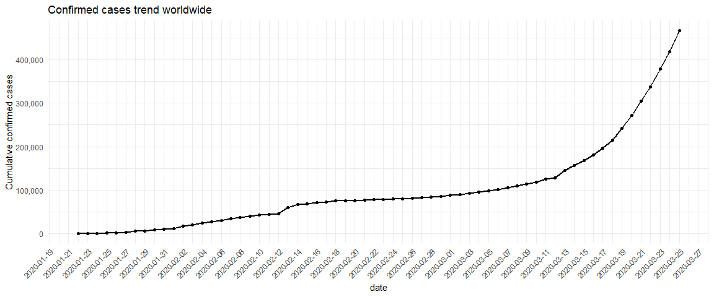


```r
confirmed_cases_worldwide %>% 
  filter(type=="death") %>% 
  group_by(date, type) %>% 
  summarise(cum_cases = sum(cum_cases)) %>% 
  ggplot(aes(x=date, y=cum_cases))+
  geom_line(size=1) +
  geom_point()+
  ylab("Cumulative confirmed deaths")+
  ggtitle("Confirmed deaths trend worldwide")+
  theme_minimal()+
  scale_y_continuous(labels = comma)+
  scale_x_date(breaks = "2 days")+
  theme(axis.text.x = element_text(angle =45 , hjust = 1))
```

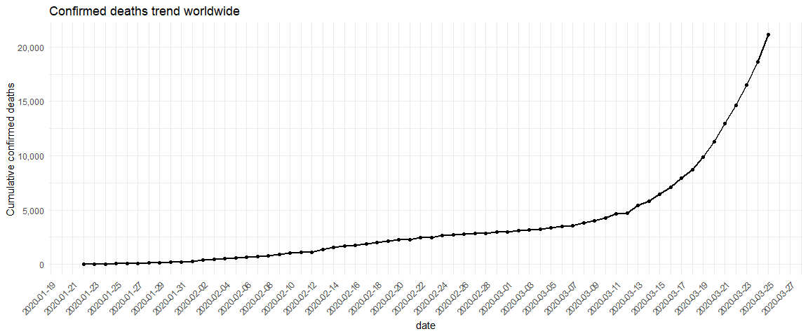


```r
confirmed_cases_worldwide %>% 
  group_by(date, type) %>% 
  summarise(cum_cases = sum(cum_cases)) %>% 
  ggplot(aes(x=date, y=cum_cases))+
  geom_line(aes(color=type, group=type),size=1) +
  geom_point(aes(color=type))+
  ylab("Cumulative confirmed cases")+
  ggtitle("Confirmed cases/deaths trend worldwide")+
  theme_minimal()+
  scale_y_continuous(labels = comma)+
  scale_x_date(breaks = "2 days")+
  theme(axis.text.x = element_text(angle =45 , hjust = 1))
```

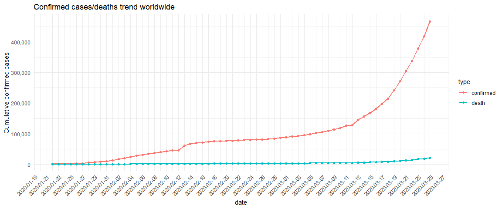


## 3. China compared to the rest of the world
<p>The y-axis in that plot is pretty scary, with the total number of confirmed cases around the world approaching 500,000. Beyond that, some weird things are happening: there is an odd jump in mid February, then the rate of new cases slows down for a while, then speeds up again in March. We need to dig deeper to see what is happening.</p>
<p>Early on in the outbreak, the COVID-19 cases were primarily centered in China. Let's plot confirmed COVID-19 cases in China and the rest of the world separately to see if it gives us any insight.</p>
<p><em>We'll build on this plot in future tasks. One thing that will be important for the following tasks is that you add aesthetics within the line geometry of your ggplot, rather than making them global aesthetics.</em></p>


```r
confirmed_cases_china_vs_world <- 
  confirmed_cases_worldwide %>% 
  mutate(
    is_china = if_else(country == "China", "China","Not China")
  ) %>% 
  group_by(is_china, date, type) %>% 
  summarise(
    cum_cases = sum(cum_cases)
  )

confirmed_cases_china_vs_world %>% 
  kable("html", align = "llrr",format.args = list(big.mark = ",")) %>%
  kable_styling("striped", "hover") %>% 
  scroll_box(height = "256px", width = "100%")
```

<div style="border: 1px solid #ddd; padding: 0px; overflow-y: scroll; height:256px; overflow-x: scroll; width:100%; "><table class="table table-striped" style="margin-left: auto; margin-right: auto;">
 <thead>
  <tr>
   <th style="text-align:left;position: sticky; top:0; background-color: #FFFFFF;"> is_china </th>
   <th style="text-align:left;position: sticky; top:0; background-color: #FFFFFF;"> date </th>
   <th style="text-align:right;position: sticky; top:0; background-color: #FFFFFF;"> type </th>
   <th style="text-align:right;position: sticky; top:0; background-color: #FFFFFF;"> cum_cases </th>
  </tr>
 </thead>
<tbody>
  <tr>
   <td style="text-align:left;"> China </td>
   <td style="text-align:left;"> 2020-01-22 </td>
   <td style="text-align:right;"> confirmed </td>
   <td style="text-align:right;"> 548 </td>
  </tr>
  <tr>
   <td style="text-align:left;"> China </td>
   <td style="text-align:left;"> 2020-01-22 </td>
   <td style="text-align:right;"> death </td>
   <td style="text-align:right;"> 17 </td>
  </tr>
  <tr>
   <td style="text-align:left;"> China </td>
   <td style="text-align:left;"> 2020-01-23 </td>
   <td style="text-align:right;"> confirmed </td>
   <td style="text-align:right;"> 643 </td>
  </tr>
  <tr>
   <td style="text-align:left;"> China </td>
   <td style="text-align:left;"> 2020-01-23 </td>
   <td style="text-align:right;"> death </td>
   <td style="text-align:right;"> 18 </td>
  </tr>
  <tr>
   <td style="text-align:left;"> China </td>
   <td style="text-align:left;"> 2020-01-24 </td>
   <td style="text-align:right;"> confirmed </td>
   <td style="text-align:right;"> 920 </td>
  </tr>
  <tr>
   <td style="text-align:left;"> China </td>
   <td style="text-align:left;"> 2020-01-24 </td>
   <td style="text-align:right;"> death </td>
   <td style="text-align:right;"> 26 </td>
  </tr>
  <tr>
   <td style="text-align:left;"> China </td>
   <td style="text-align:left;"> 2020-01-25 </td>
   <td style="text-align:right;"> confirmed </td>
   <td style="text-align:right;"> 1,406 </td>
  </tr>
  <tr>
   <td style="text-align:left;"> China </td>
   <td style="text-align:left;"> 2020-01-25 </td>
   <td style="text-align:right;"> death </td>
   <td style="text-align:right;"> 42 </td>
  </tr>
  <tr>
   <td style="text-align:left;"> China </td>
   <td style="text-align:left;"> 2020-01-26 </td>
   <td style="text-align:right;"> confirmed </td>
   <td style="text-align:right;"> 2,075 </td>
  </tr>
  <tr>
   <td style="text-align:left;"> China </td>
   <td style="text-align:left;"> 2020-01-26 </td>
   <td style="text-align:right;"> death </td>
   <td style="text-align:right;"> 56 </td>
  </tr>
  <tr>
   <td style="text-align:left;"> China </td>
   <td style="text-align:left;"> 2020-01-27 </td>
   <td style="text-align:right;"> confirmed </td>
   <td style="text-align:right;"> 2,877 </td>
  </tr>
  <tr>
   <td style="text-align:left;"> China </td>
   <td style="text-align:left;"> 2020-01-27 </td>
   <td style="text-align:right;"> death </td>
   <td style="text-align:right;"> 82 </td>
  </tr>
  <tr>
   <td style="text-align:left;"> China </td>
   <td style="text-align:left;"> 2020-01-28 </td>
   <td style="text-align:right;"> confirmed </td>
   <td style="text-align:right;"> 5,509 </td>
  </tr>
  <tr>
   <td style="text-align:left;"> China </td>
   <td style="text-align:left;"> 2020-01-28 </td>
   <td style="text-align:right;"> death </td>
   <td style="text-align:right;"> 131 </td>
  </tr>
  <tr>
   <td style="text-align:left;"> China </td>
   <td style="text-align:left;"> 2020-01-29 </td>
   <td style="text-align:right;"> confirmed </td>
   <td style="text-align:right;"> 6,087 </td>
  </tr>
  <tr>
   <td style="text-align:left;"> China </td>
   <td style="text-align:left;"> 2020-01-29 </td>
   <td style="text-align:right;"> death </td>
   <td style="text-align:right;"> 133 </td>
  </tr>
  <tr>
   <td style="text-align:left;"> China </td>
   <td style="text-align:left;"> 2020-01-30 </td>
   <td style="text-align:right;"> confirmed </td>
   <td style="text-align:right;"> 8,141 </td>
  </tr>
  <tr>
   <td style="text-align:left;"> China </td>
   <td style="text-align:left;"> 2020-01-30 </td>
   <td style="text-align:right;"> death </td>
   <td style="text-align:right;"> 171 </td>
  </tr>
  <tr>
   <td style="text-align:left;"> China </td>
   <td style="text-align:left;"> 2020-01-31 </td>
   <td style="text-align:right;"> confirmed </td>
   <td style="text-align:right;"> 9,802 </td>
  </tr>
  <tr>
   <td style="text-align:left;"> China </td>
   <td style="text-align:left;"> 2020-01-31 </td>
   <td style="text-align:right;"> death </td>
   <td style="text-align:right;"> 213 </td>
  </tr>
  <tr>
   <td style="text-align:left;"> China </td>
   <td style="text-align:left;"> 2020-02-01 </td>
   <td style="text-align:right;"> confirmed </td>
   <td style="text-align:right;"> 11,891 </td>
  </tr>
  <tr>
   <td style="text-align:left;"> China </td>
   <td style="text-align:left;"> 2020-02-01 </td>
   <td style="text-align:right;"> death </td>
   <td style="text-align:right;"> 259 </td>
  </tr>
  <tr>
   <td style="text-align:left;"> China </td>
   <td style="text-align:left;"> 2020-02-02 </td>
   <td style="text-align:right;"> confirmed </td>
   <td style="text-align:right;"> 16,630 </td>
  </tr>
  <tr>
   <td style="text-align:left;"> China </td>
   <td style="text-align:left;"> 2020-02-02 </td>
   <td style="text-align:right;"> death </td>
   <td style="text-align:right;"> 361 </td>
  </tr>
  <tr>
   <td style="text-align:left;"> China </td>
   <td style="text-align:left;"> 2020-02-03 </td>
   <td style="text-align:right;"> confirmed </td>
   <td style="text-align:right;"> 19,716 </td>
  </tr>
  <tr>
   <td style="text-align:left;"> China </td>
   <td style="text-align:left;"> 2020-02-03 </td>
   <td style="text-align:right;"> death </td>
   <td style="text-align:right;"> 425 </td>
  </tr>
  <tr>
   <td style="text-align:left;"> China </td>
   <td style="text-align:left;"> 2020-02-04 </td>
   <td style="text-align:right;"> confirmed </td>
   <td style="text-align:right;"> 23,707 </td>
  </tr>
  <tr>
   <td style="text-align:left;"> China </td>
   <td style="text-align:left;"> 2020-02-04 </td>
   <td style="text-align:right;"> death </td>
   <td style="text-align:right;"> 491 </td>
  </tr>
  <tr>
   <td style="text-align:left;"> China </td>
   <td style="text-align:left;"> 2020-02-05 </td>
   <td style="text-align:right;"> confirmed </td>
   <td style="text-align:right;"> 27,440 </td>
  </tr>
  <tr>
   <td style="text-align:left;"> China </td>
   <td style="text-align:left;"> 2020-02-05 </td>
   <td style="text-align:right;"> death </td>
   <td style="text-align:right;"> 563 </td>
  </tr>
  <tr>
   <td style="text-align:left;"> China </td>
   <td style="text-align:left;"> 2020-02-06 </td>
   <td style="text-align:right;"> confirmed </td>
   <td style="text-align:right;"> 30,587 </td>
  </tr>
  <tr>
   <td style="text-align:left;"> China </td>
   <td style="text-align:left;"> 2020-02-06 </td>
   <td style="text-align:right;"> death </td>
   <td style="text-align:right;"> 633 </td>
  </tr>
  <tr>
   <td style="text-align:left;"> China </td>
   <td style="text-align:left;"> 2020-02-07 </td>
   <td style="text-align:right;"> confirmed </td>
   <td style="text-align:right;"> 34,110 </td>
  </tr>
  <tr>
   <td style="text-align:left;"> China </td>
   <td style="text-align:left;"> 2020-02-07 </td>
   <td style="text-align:right;"> death </td>
   <td style="text-align:right;"> 718 </td>
  </tr>
  <tr>
   <td style="text-align:left;"> China </td>
   <td style="text-align:left;"> 2020-02-08 </td>
   <td style="text-align:right;"> confirmed </td>
   <td style="text-align:right;"> 36,814 </td>
  </tr>
  <tr>
   <td style="text-align:left;"> China </td>
   <td style="text-align:left;"> 2020-02-08 </td>
   <td style="text-align:right;"> death </td>
   <td style="text-align:right;"> 805 </td>
  </tr>
  <tr>
   <td style="text-align:left;"> China </td>
   <td style="text-align:left;"> 2020-02-09 </td>
   <td style="text-align:right;"> confirmed </td>
   <td style="text-align:right;"> 39,829 </td>
  </tr>
  <tr>
   <td style="text-align:left;"> China </td>
   <td style="text-align:left;"> 2020-02-09 </td>
   <td style="text-align:right;"> death </td>
   <td style="text-align:right;"> 905 </td>
  </tr>
  <tr>
   <td style="text-align:left;"> China </td>
   <td style="text-align:left;"> 2020-02-10 </td>
   <td style="text-align:right;"> confirmed </td>
   <td style="text-align:right;"> 42,354 </td>
  </tr>
  <tr>
   <td style="text-align:left;"> China </td>
   <td style="text-align:left;"> 2020-02-10 </td>
   <td style="text-align:right;"> death </td>
   <td style="text-align:right;"> 1,012 </td>
  </tr>
  <tr>
   <td style="text-align:left;"> China </td>
   <td style="text-align:left;"> 2020-02-11 </td>
   <td style="text-align:right;"> confirmed </td>
   <td style="text-align:right;"> 44,386 </td>
  </tr>
  <tr>
   <td style="text-align:left;"> China </td>
   <td style="text-align:left;"> 2020-02-11 </td>
   <td style="text-align:right;"> death </td>
   <td style="text-align:right;"> 1,112 </td>
  </tr>
  <tr>
   <td style="text-align:left;"> China </td>
   <td style="text-align:left;"> 2020-02-12 </td>
   <td style="text-align:right;"> confirmed </td>
   <td style="text-align:right;"> 44,759 </td>
  </tr>
  <tr>
   <td style="text-align:left;"> China </td>
   <td style="text-align:left;"> 2020-02-12 </td>
   <td style="text-align:right;"> death </td>
   <td style="text-align:right;"> 1,117 </td>
  </tr>
  <tr>
   <td style="text-align:left;"> China </td>
   <td style="text-align:left;"> 2020-02-13 </td>
   <td style="text-align:right;"> confirmed </td>
   <td style="text-align:right;"> 59,895 </td>
  </tr>
  <tr>
   <td style="text-align:left;"> China </td>
   <td style="text-align:left;"> 2020-02-13 </td>
   <td style="text-align:right;"> death </td>
   <td style="text-align:right;"> 1,369 </td>
  </tr>
  <tr>
   <td style="text-align:left;"> China </td>
   <td style="text-align:left;"> 2020-02-14 </td>
   <td style="text-align:right;"> confirmed </td>
   <td style="text-align:right;"> 66,358 </td>
  </tr>
  <tr>
   <td style="text-align:left;"> China </td>
   <td style="text-align:left;"> 2020-02-14 </td>
   <td style="text-align:right;"> death </td>
   <td style="text-align:right;"> 1,521 </td>
  </tr>
  <tr>
   <td style="text-align:left;"> China </td>
   <td style="text-align:left;"> 2020-02-15 </td>
   <td style="text-align:right;"> confirmed </td>
   <td style="text-align:right;"> 68,413 </td>
  </tr>
  <tr>
   <td style="text-align:left;"> China </td>
   <td style="text-align:left;"> 2020-02-15 </td>
   <td style="text-align:right;"> death </td>
   <td style="text-align:right;"> 1,663 </td>
  </tr>
  <tr>
   <td style="text-align:left;"> China </td>
   <td style="text-align:left;"> 2020-02-16 </td>
   <td style="text-align:right;"> confirmed </td>
   <td style="text-align:right;"> 70,513 </td>
  </tr>
  <tr>
   <td style="text-align:left;"> China </td>
   <td style="text-align:left;"> 2020-02-16 </td>
   <td style="text-align:right;"> death </td>
   <td style="text-align:right;"> 1,766 </td>
  </tr>
  <tr>
   <td style="text-align:left;"> China </td>
   <td style="text-align:left;"> 2020-02-17 </td>
   <td style="text-align:right;"> confirmed </td>
   <td style="text-align:right;"> 72,434 </td>
  </tr>
  <tr>
   <td style="text-align:left;"> China </td>
   <td style="text-align:left;"> 2020-02-17 </td>
   <td style="text-align:right;"> death </td>
   <td style="text-align:right;"> 1,864 </td>
  </tr>
  <tr>
   <td style="text-align:left;"> China </td>
   <td style="text-align:left;"> 2020-02-18 </td>
   <td style="text-align:right;"> confirmed </td>
   <td style="text-align:right;"> 74,211 </td>
  </tr>
  <tr>
   <td style="text-align:left;"> China </td>
   <td style="text-align:left;"> 2020-02-18 </td>
   <td style="text-align:right;"> death </td>
   <td style="text-align:right;"> 2,003 </td>
  </tr>
  <tr>
   <td style="text-align:left;"> China </td>
   <td style="text-align:left;"> 2020-02-19 </td>
   <td style="text-align:right;"> confirmed </td>
   <td style="text-align:right;"> 74,619 </td>
  </tr>
  <tr>
   <td style="text-align:left;"> China </td>
   <td style="text-align:left;"> 2020-02-19 </td>
   <td style="text-align:right;"> death </td>
   <td style="text-align:right;"> 2,116 </td>
  </tr>
  <tr>
   <td style="text-align:left;"> China </td>
   <td style="text-align:left;"> 2020-02-20 </td>
   <td style="text-align:right;"> confirmed </td>
   <td style="text-align:right;"> 75,077 </td>
  </tr>
  <tr>
   <td style="text-align:left;"> China </td>
   <td style="text-align:left;"> 2020-02-20 </td>
   <td style="text-align:right;"> death </td>
   <td style="text-align:right;"> 2,238 </td>
  </tr>
  <tr>
   <td style="text-align:left;"> China </td>
   <td style="text-align:left;"> 2020-02-21 </td>
   <td style="text-align:right;"> confirmed </td>
   <td style="text-align:right;"> 75,550 </td>
  </tr>
  <tr>
   <td style="text-align:left;"> China </td>
   <td style="text-align:left;"> 2020-02-21 </td>
   <td style="text-align:right;"> death </td>
   <td style="text-align:right;"> 2,238 </td>
  </tr>
  <tr>
   <td style="text-align:left;"> China </td>
   <td style="text-align:left;"> 2020-02-22 </td>
   <td style="text-align:right;"> confirmed </td>
   <td style="text-align:right;"> 77,001 </td>
  </tr>
  <tr>
   <td style="text-align:left;"> China </td>
   <td style="text-align:left;"> 2020-02-22 </td>
   <td style="text-align:right;"> death </td>
   <td style="text-align:right;"> 2,443 </td>
  </tr>
  <tr>
   <td style="text-align:left;"> China </td>
   <td style="text-align:left;"> 2020-02-23 </td>
   <td style="text-align:right;"> confirmed </td>
   <td style="text-align:right;"> 77,022 </td>
  </tr>
  <tr>
   <td style="text-align:left;"> China </td>
   <td style="text-align:left;"> 2020-02-23 </td>
   <td style="text-align:right;"> death </td>
   <td style="text-align:right;"> 2,445 </td>
  </tr>
  <tr>
   <td style="text-align:left;"> China </td>
   <td style="text-align:left;"> 2020-02-24 </td>
   <td style="text-align:right;"> confirmed </td>
   <td style="text-align:right;"> 77,241 </td>
  </tr>
  <tr>
   <td style="text-align:left;"> China </td>
   <td style="text-align:left;"> 2020-02-24 </td>
   <td style="text-align:right;"> death </td>
   <td style="text-align:right;"> 2,595 </td>
  </tr>
  <tr>
   <td style="text-align:left;"> China </td>
   <td style="text-align:left;"> 2020-02-25 </td>
   <td style="text-align:right;"> confirmed </td>
   <td style="text-align:right;"> 77,754 </td>
  </tr>
  <tr>
   <td style="text-align:left;"> China </td>
   <td style="text-align:left;"> 2020-02-25 </td>
   <td style="text-align:right;"> death </td>
   <td style="text-align:right;"> 2,665 </td>
  </tr>
  <tr>
   <td style="text-align:left;"> China </td>
   <td style="text-align:left;"> 2020-02-26 </td>
   <td style="text-align:right;"> confirmed </td>
   <td style="text-align:right;"> 78,166 </td>
  </tr>
  <tr>
   <td style="text-align:left;"> China </td>
   <td style="text-align:left;"> 2020-02-26 </td>
   <td style="text-align:right;"> death </td>
   <td style="text-align:right;"> 2,717 </td>
  </tr>
  <tr>
   <td style="text-align:left;"> China </td>
   <td style="text-align:left;"> 2020-02-27 </td>
   <td style="text-align:right;"> confirmed </td>
   <td style="text-align:right;"> 78,600 </td>
  </tr>
  <tr>
   <td style="text-align:left;"> China </td>
   <td style="text-align:left;"> 2020-02-27 </td>
   <td style="text-align:right;"> death </td>
   <td style="text-align:right;"> 2,746 </td>
  </tr>
  <tr>
   <td style="text-align:left;"> China </td>
   <td style="text-align:left;"> 2020-02-28 </td>
   <td style="text-align:right;"> confirmed </td>
   <td style="text-align:right;"> 78,928 </td>
  </tr>
  <tr>
   <td style="text-align:left;"> China </td>
   <td style="text-align:left;"> 2020-02-28 </td>
   <td style="text-align:right;"> death </td>
   <td style="text-align:right;"> 2,790 </td>
  </tr>
  <tr>
   <td style="text-align:left;"> China </td>
   <td style="text-align:left;"> 2020-02-29 </td>
   <td style="text-align:right;"> confirmed </td>
   <td style="text-align:right;"> 79,356 </td>
  </tr>
  <tr>
   <td style="text-align:left;"> China </td>
   <td style="text-align:left;"> 2020-02-29 </td>
   <td style="text-align:right;"> death </td>
   <td style="text-align:right;"> 2,837 </td>
  </tr>
  <tr>
   <td style="text-align:left;"> China </td>
   <td style="text-align:left;"> 2020-03-01 </td>
   <td style="text-align:right;"> confirmed </td>
   <td style="text-align:right;"> 79,932 </td>
  </tr>
  <tr>
   <td style="text-align:left;"> China </td>
   <td style="text-align:left;"> 2020-03-01 </td>
   <td style="text-align:right;"> death </td>
   <td style="text-align:right;"> 2,872 </td>
  </tr>
  <tr>
   <td style="text-align:left;"> China </td>
   <td style="text-align:left;"> 2020-03-02 </td>
   <td style="text-align:right;"> confirmed </td>
   <td style="text-align:right;"> 80,136 </td>
  </tr>
  <tr>
   <td style="text-align:left;"> China </td>
   <td style="text-align:left;"> 2020-03-02 </td>
   <td style="text-align:right;"> death </td>
   <td style="text-align:right;"> 2,914 </td>
  </tr>
  <tr>
   <td style="text-align:left;"> China </td>
   <td style="text-align:left;"> 2020-03-03 </td>
   <td style="text-align:right;"> confirmed </td>
   <td style="text-align:right;"> 80,261 </td>
  </tr>
  <tr>
   <td style="text-align:left;"> China </td>
   <td style="text-align:left;"> 2020-03-03 </td>
   <td style="text-align:right;"> death </td>
   <td style="text-align:right;"> 2,947 </td>
  </tr>
  <tr>
   <td style="text-align:left;"> China </td>
   <td style="text-align:left;"> 2020-03-04 </td>
   <td style="text-align:right;"> confirmed </td>
   <td style="text-align:right;"> 80,386 </td>
  </tr>
  <tr>
   <td style="text-align:left;"> China </td>
   <td style="text-align:left;"> 2020-03-04 </td>
   <td style="text-align:right;"> death </td>
   <td style="text-align:right;"> 2,983 </td>
  </tr>
  <tr>
   <td style="text-align:left;"> China </td>
   <td style="text-align:left;"> 2020-03-05 </td>
   <td style="text-align:right;"> confirmed </td>
   <td style="text-align:right;"> 80,537 </td>
  </tr>
  <tr>
   <td style="text-align:left;"> China </td>
   <td style="text-align:left;"> 2020-03-05 </td>
   <td style="text-align:right;"> death </td>
   <td style="text-align:right;"> 3,015 </td>
  </tr>
  <tr>
   <td style="text-align:left;"> China </td>
   <td style="text-align:left;"> 2020-03-06 </td>
   <td style="text-align:right;"> confirmed </td>
   <td style="text-align:right;"> 80,690 </td>
  </tr>
  <tr>
   <td style="text-align:left;"> China </td>
   <td style="text-align:left;"> 2020-03-06 </td>
   <td style="text-align:right;"> death </td>
   <td style="text-align:right;"> 3,044 </td>
  </tr>
  <tr>
   <td style="text-align:left;"> China </td>
   <td style="text-align:left;"> 2020-03-07 </td>
   <td style="text-align:right;"> confirmed </td>
   <td style="text-align:right;"> 80,770 </td>
  </tr>
  <tr>
   <td style="text-align:left;"> China </td>
   <td style="text-align:left;"> 2020-03-07 </td>
   <td style="text-align:right;"> death </td>
   <td style="text-align:right;"> 3,072 </td>
  </tr>
  <tr>
   <td style="text-align:left;"> China </td>
   <td style="text-align:left;"> 2020-03-08 </td>
   <td style="text-align:right;"> confirmed </td>
   <td style="text-align:right;"> 80,823 </td>
  </tr>
  <tr>
   <td style="text-align:left;"> China </td>
   <td style="text-align:left;"> 2020-03-08 </td>
   <td style="text-align:right;"> death </td>
   <td style="text-align:right;"> 3,100 </td>
  </tr>
  <tr>
   <td style="text-align:left;"> China </td>
   <td style="text-align:left;"> 2020-03-09 </td>
   <td style="text-align:right;"> confirmed </td>
   <td style="text-align:right;"> 80,860 </td>
  </tr>
  <tr>
   <td style="text-align:left;"> China </td>
   <td style="text-align:left;"> 2020-03-09 </td>
   <td style="text-align:right;"> death </td>
   <td style="text-align:right;"> 3,123 </td>
  </tr>
  <tr>
   <td style="text-align:left;"> China </td>
   <td style="text-align:left;"> 2020-03-10 </td>
   <td style="text-align:right;"> confirmed </td>
   <td style="text-align:right;"> 80,887 </td>
  </tr>
  <tr>
   <td style="text-align:left;"> China </td>
   <td style="text-align:left;"> 2020-03-10 </td>
   <td style="text-align:right;"> death </td>
   <td style="text-align:right;"> 3,139 </td>
  </tr>
  <tr>
   <td style="text-align:left;"> China </td>
   <td style="text-align:left;"> 2020-03-11 </td>
   <td style="text-align:right;"> confirmed </td>
   <td style="text-align:right;"> 80,921 </td>
  </tr>
  <tr>
   <td style="text-align:left;"> China </td>
   <td style="text-align:left;"> 2020-03-11 </td>
   <td style="text-align:right;"> death </td>
   <td style="text-align:right;"> 3,161 </td>
  </tr>
  <tr>
   <td style="text-align:left;"> China </td>
   <td style="text-align:left;"> 2020-03-12 </td>
   <td style="text-align:right;"> confirmed </td>
   <td style="text-align:right;"> 80,932 </td>
  </tr>
  <tr>
   <td style="text-align:left;"> China </td>
   <td style="text-align:left;"> 2020-03-12 </td>
   <td style="text-align:right;"> death </td>
   <td style="text-align:right;"> 3,172 </td>
  </tr>
  <tr>
   <td style="text-align:left;"> China </td>
   <td style="text-align:left;"> 2020-03-13 </td>
   <td style="text-align:right;"> confirmed </td>
   <td style="text-align:right;"> 80,945 </td>
  </tr>
  <tr>
   <td style="text-align:left;"> China </td>
   <td style="text-align:left;"> 2020-03-13 </td>
   <td style="text-align:right;"> death </td>
   <td style="text-align:right;"> 3,180 </td>
  </tr>
  <tr>
   <td style="text-align:left;"> China </td>
   <td style="text-align:left;"> 2020-03-14 </td>
   <td style="text-align:right;"> confirmed </td>
   <td style="text-align:right;"> 80,977 </td>
  </tr>
  <tr>
   <td style="text-align:left;"> China </td>
   <td style="text-align:left;"> 2020-03-14 </td>
   <td style="text-align:right;"> death </td>
   <td style="text-align:right;"> 3,193 </td>
  </tr>
  <tr>
   <td style="text-align:left;"> China </td>
   <td style="text-align:left;"> 2020-03-15 </td>
   <td style="text-align:right;"> confirmed </td>
   <td style="text-align:right;"> 81,003 </td>
  </tr>
  <tr>
   <td style="text-align:left;"> China </td>
   <td style="text-align:left;"> 2020-03-15 </td>
   <td style="text-align:right;"> death </td>
   <td style="text-align:right;"> 3,203 </td>
  </tr>
  <tr>
   <td style="text-align:left;"> China </td>
   <td style="text-align:left;"> 2020-03-16 </td>
   <td style="text-align:right;"> confirmed </td>
   <td style="text-align:right;"> 81,033 </td>
  </tr>
  <tr>
   <td style="text-align:left;"> China </td>
   <td style="text-align:left;"> 2020-03-16 </td>
   <td style="text-align:right;"> death </td>
   <td style="text-align:right;"> 3,217 </td>
  </tr>
  <tr>
   <td style="text-align:left;"> China </td>
   <td style="text-align:left;"> 2020-03-17 </td>
   <td style="text-align:right;"> confirmed </td>
   <td style="text-align:right;"> 81,058 </td>
  </tr>
  <tr>
   <td style="text-align:left;"> China </td>
   <td style="text-align:left;"> 2020-03-17 </td>
   <td style="text-align:right;"> death </td>
   <td style="text-align:right;"> 3,230 </td>
  </tr>
  <tr>
   <td style="text-align:left;"> China </td>
   <td style="text-align:left;"> 2020-03-18 </td>
   <td style="text-align:right;"> confirmed </td>
   <td style="text-align:right;"> 81,102 </td>
  </tr>
  <tr>
   <td style="text-align:left;"> China </td>
   <td style="text-align:left;"> 2020-03-18 </td>
   <td style="text-align:right;"> death </td>
   <td style="text-align:right;"> 3,241 </td>
  </tr>
  <tr>
   <td style="text-align:left;"> China </td>
   <td style="text-align:left;"> 2020-03-19 </td>
   <td style="text-align:right;"> confirmed </td>
   <td style="text-align:right;"> 81,156 </td>
  </tr>
  <tr>
   <td style="text-align:left;"> China </td>
   <td style="text-align:left;"> 2020-03-19 </td>
   <td style="text-align:right;"> death </td>
   <td style="text-align:right;"> 3,249 </td>
  </tr>
  <tr>
   <td style="text-align:left;"> China </td>
   <td style="text-align:left;"> 2020-03-20 </td>
   <td style="text-align:right;"> confirmed </td>
   <td style="text-align:right;"> 81,250 </td>
  </tr>
  <tr>
   <td style="text-align:left;"> China </td>
   <td style="text-align:left;"> 2020-03-20 </td>
   <td style="text-align:right;"> death </td>
   <td style="text-align:right;"> 3,253 </td>
  </tr>
  <tr>
   <td style="text-align:left;"> China </td>
   <td style="text-align:left;"> 2020-03-21 </td>
   <td style="text-align:right;"> confirmed </td>
   <td style="text-align:right;"> 81,305 </td>
  </tr>
  <tr>
   <td style="text-align:left;"> China </td>
   <td style="text-align:left;"> 2020-03-21 </td>
   <td style="text-align:right;"> death </td>
   <td style="text-align:right;"> 3,259 </td>
  </tr>
  <tr>
   <td style="text-align:left;"> China </td>
   <td style="text-align:left;"> 2020-03-22 </td>
   <td style="text-align:right;"> confirmed </td>
   <td style="text-align:right;"> 81,435 </td>
  </tr>
  <tr>
   <td style="text-align:left;"> China </td>
   <td style="text-align:left;"> 2020-03-22 </td>
   <td style="text-align:right;"> death </td>
   <td style="text-align:right;"> 3,274 </td>
  </tr>
  <tr>
   <td style="text-align:left;"> China </td>
   <td style="text-align:left;"> 2020-03-23 </td>
   <td style="text-align:right;"> confirmed </td>
   <td style="text-align:right;"> 81,498 </td>
  </tr>
  <tr>
   <td style="text-align:left;"> China </td>
   <td style="text-align:left;"> 2020-03-23 </td>
   <td style="text-align:right;"> death </td>
   <td style="text-align:right;"> 3,274 </td>
  </tr>
  <tr>
   <td style="text-align:left;"> China </td>
   <td style="text-align:left;"> 2020-03-24 </td>
   <td style="text-align:right;"> confirmed </td>
   <td style="text-align:right;"> 81,591 </td>
  </tr>
  <tr>
   <td style="text-align:left;"> China </td>
   <td style="text-align:left;"> 2020-03-24 </td>
   <td style="text-align:right;"> death </td>
   <td style="text-align:right;"> 3,281 </td>
  </tr>
  <tr>
   <td style="text-align:left;"> China </td>
   <td style="text-align:left;"> 2020-03-25 </td>
   <td style="text-align:right;"> confirmed </td>
   <td style="text-align:right;"> 81,661 </td>
  </tr>
  <tr>
   <td style="text-align:left;"> China </td>
   <td style="text-align:left;"> 2020-03-25 </td>
   <td style="text-align:right;"> death </td>
   <td style="text-align:right;"> 3,285 </td>
  </tr>
  <tr>
   <td style="text-align:left;"> Not China </td>
   <td style="text-align:left;"> 2020-01-22 </td>
   <td style="text-align:right;"> confirmed </td>
   <td style="text-align:right;"> 7 </td>
  </tr>
  <tr>
   <td style="text-align:left;"> Not China </td>
   <td style="text-align:left;"> 2020-01-22 </td>
   <td style="text-align:right;"> death </td>
   <td style="text-align:right;"> 0 </td>
  </tr>
  <tr>
   <td style="text-align:left;"> Not China </td>
   <td style="text-align:left;"> 2020-01-23 </td>
   <td style="text-align:right;"> confirmed </td>
   <td style="text-align:right;"> 11 </td>
  </tr>
  <tr>
   <td style="text-align:left;"> Not China </td>
   <td style="text-align:left;"> 2020-01-23 </td>
   <td style="text-align:right;"> death </td>
   <td style="text-align:right;"> 0 </td>
  </tr>
  <tr>
   <td style="text-align:left;"> Not China </td>
   <td style="text-align:left;"> 2020-01-24 </td>
   <td style="text-align:right;"> confirmed </td>
   <td style="text-align:right;"> 21 </td>
  </tr>
  <tr>
   <td style="text-align:left;"> Not China </td>
   <td style="text-align:left;"> 2020-01-24 </td>
   <td style="text-align:right;"> death </td>
   <td style="text-align:right;"> 0 </td>
  </tr>
  <tr>
   <td style="text-align:left;"> Not China </td>
   <td style="text-align:left;"> 2020-01-25 </td>
   <td style="text-align:right;"> confirmed </td>
   <td style="text-align:right;"> 28 </td>
  </tr>
  <tr>
   <td style="text-align:left;"> Not China </td>
   <td style="text-align:left;"> 2020-01-25 </td>
   <td style="text-align:right;"> death </td>
   <td style="text-align:right;"> 0 </td>
  </tr>
  <tr>
   <td style="text-align:left;"> Not China </td>
   <td style="text-align:left;"> 2020-01-26 </td>
   <td style="text-align:right;"> confirmed </td>
   <td style="text-align:right;"> 43 </td>
  </tr>
  <tr>
   <td style="text-align:left;"> Not China </td>
   <td style="text-align:left;"> 2020-01-26 </td>
   <td style="text-align:right;"> death </td>
   <td style="text-align:right;"> 0 </td>
  </tr>
  <tr>
   <td style="text-align:left;"> Not China </td>
   <td style="text-align:left;"> 2020-01-27 </td>
   <td style="text-align:right;"> confirmed </td>
   <td style="text-align:right;"> 50 </td>
  </tr>
  <tr>
   <td style="text-align:left;"> Not China </td>
   <td style="text-align:left;"> 2020-01-27 </td>
   <td style="text-align:right;"> death </td>
   <td style="text-align:right;"> 0 </td>
  </tr>
  <tr>
   <td style="text-align:left;"> Not China </td>
   <td style="text-align:left;"> 2020-01-28 </td>
   <td style="text-align:right;"> confirmed </td>
   <td style="text-align:right;"> 69 </td>
  </tr>
  <tr>
   <td style="text-align:left;"> Not China </td>
   <td style="text-align:left;"> 2020-01-28 </td>
   <td style="text-align:right;"> death </td>
   <td style="text-align:right;"> 0 </td>
  </tr>
  <tr>
   <td style="text-align:left;"> Not China </td>
   <td style="text-align:left;"> 2020-01-29 </td>
   <td style="text-align:right;"> confirmed </td>
   <td style="text-align:right;"> 79 </td>
  </tr>
  <tr>
   <td style="text-align:left;"> Not China </td>
   <td style="text-align:left;"> 2020-01-29 </td>
   <td style="text-align:right;"> death </td>
   <td style="text-align:right;"> 0 </td>
  </tr>
  <tr>
   <td style="text-align:left;"> Not China </td>
   <td style="text-align:left;"> 2020-01-30 </td>
   <td style="text-align:right;"> confirmed </td>
   <td style="text-align:right;"> 93 </td>
  </tr>
  <tr>
   <td style="text-align:left;"> Not China </td>
   <td style="text-align:left;"> 2020-01-30 </td>
   <td style="text-align:right;"> death </td>
   <td style="text-align:right;"> 0 </td>
  </tr>
  <tr>
   <td style="text-align:left;"> Not China </td>
   <td style="text-align:left;"> 2020-01-31 </td>
   <td style="text-align:right;"> confirmed </td>
   <td style="text-align:right;"> 125 </td>
  </tr>
  <tr>
   <td style="text-align:left;"> Not China </td>
   <td style="text-align:left;"> 2020-01-31 </td>
   <td style="text-align:right;"> death </td>
   <td style="text-align:right;"> 0 </td>
  </tr>
  <tr>
   <td style="text-align:left;"> Not China </td>
   <td style="text-align:left;"> 2020-02-01 </td>
   <td style="text-align:right;"> confirmed </td>
   <td style="text-align:right;"> 147 </td>
  </tr>
  <tr>
   <td style="text-align:left;"> Not China </td>
   <td style="text-align:left;"> 2020-02-01 </td>
   <td style="text-align:right;"> death </td>
   <td style="text-align:right;"> 0 </td>
  </tr>
  <tr>
   <td style="text-align:left;"> Not China </td>
   <td style="text-align:left;"> 2020-02-02 </td>
   <td style="text-align:right;"> confirmed </td>
   <td style="text-align:right;"> 157 </td>
  </tr>
  <tr>
   <td style="text-align:left;"> Not China </td>
   <td style="text-align:left;"> 2020-02-02 </td>
   <td style="text-align:right;"> death </td>
   <td style="text-align:right;"> 1 </td>
  </tr>
  <tr>
   <td style="text-align:left;"> Not China </td>
   <td style="text-align:left;"> 2020-02-03 </td>
   <td style="text-align:right;"> confirmed </td>
   <td style="text-align:right;"> 165 </td>
  </tr>
  <tr>
   <td style="text-align:left;"> Not China </td>
   <td style="text-align:left;"> 2020-02-03 </td>
   <td style="text-align:right;"> death </td>
   <td style="text-align:right;"> 1 </td>
  </tr>
  <tr>
   <td style="text-align:left;"> Not China </td>
   <td style="text-align:left;"> 2020-02-04 </td>
   <td style="text-align:right;"> confirmed </td>
   <td style="text-align:right;"> 185 </td>
  </tr>
  <tr>
   <td style="text-align:left;"> Not China </td>
   <td style="text-align:left;"> 2020-02-04 </td>
   <td style="text-align:right;"> death </td>
   <td style="text-align:right;"> 1 </td>
  </tr>
  <tr>
   <td style="text-align:left;"> Not China </td>
   <td style="text-align:left;"> 2020-02-05 </td>
   <td style="text-align:right;"> confirmed </td>
   <td style="text-align:right;"> 195 </td>
  </tr>
  <tr>
   <td style="text-align:left;"> Not China </td>
   <td style="text-align:left;"> 2020-02-05 </td>
   <td style="text-align:right;"> death </td>
   <td style="text-align:right;"> 1 </td>
  </tr>
  <tr>
   <td style="text-align:left;"> Not China </td>
   <td style="text-align:left;"> 2020-02-06 </td>
   <td style="text-align:right;"> confirmed </td>
   <td style="text-align:right;"> 207 </td>
  </tr>
  <tr>
   <td style="text-align:left;"> Not China </td>
   <td style="text-align:left;"> 2020-02-06 </td>
   <td style="text-align:right;"> death </td>
   <td style="text-align:right;"> 1 </td>
  </tr>
  <tr>
   <td style="text-align:left;"> Not China </td>
   <td style="text-align:left;"> 2020-02-07 </td>
   <td style="text-align:right;"> confirmed </td>
   <td style="text-align:right;"> 281 </td>
  </tr>
  <tr>
   <td style="text-align:left;"> Not China </td>
   <td style="text-align:left;"> 2020-02-07 </td>
   <td style="text-align:right;"> death </td>
   <td style="text-align:right;"> 1 </td>
  </tr>
  <tr>
   <td style="text-align:left;"> Not China </td>
   <td style="text-align:left;"> 2020-02-08 </td>
   <td style="text-align:right;"> confirmed </td>
   <td style="text-align:right;"> 306 </td>
  </tr>
  <tr>
   <td style="text-align:left;"> Not China </td>
   <td style="text-align:left;"> 2020-02-08 </td>
   <td style="text-align:right;"> death </td>
   <td style="text-align:right;"> 1 </td>
  </tr>
  <tr>
   <td style="text-align:left;"> Not China </td>
   <td style="text-align:left;"> 2020-02-09 </td>
   <td style="text-align:right;"> confirmed </td>
   <td style="text-align:right;"> 321 </td>
  </tr>
  <tr>
   <td style="text-align:left;"> Not China </td>
   <td style="text-align:left;"> 2020-02-09 </td>
   <td style="text-align:right;"> death </td>
   <td style="text-align:right;"> 1 </td>
  </tr>
  <tr>
   <td style="text-align:left;"> Not China </td>
   <td style="text-align:left;"> 2020-02-10 </td>
   <td style="text-align:right;"> confirmed </td>
   <td style="text-align:right;"> 408 </td>
  </tr>
  <tr>
   <td style="text-align:left;"> Not China </td>
   <td style="text-align:left;"> 2020-02-10 </td>
   <td style="text-align:right;"> death </td>
   <td style="text-align:right;"> 1 </td>
  </tr>
  <tr>
   <td style="text-align:left;"> Not China </td>
   <td style="text-align:left;"> 2020-02-11 </td>
   <td style="text-align:right;"> confirmed </td>
   <td style="text-align:right;"> 416 </td>
  </tr>
  <tr>
   <td style="text-align:left;"> Not China </td>
   <td style="text-align:left;"> 2020-02-11 </td>
   <td style="text-align:right;"> death </td>
   <td style="text-align:right;"> 1 </td>
  </tr>
  <tr>
   <td style="text-align:left;"> Not China </td>
   <td style="text-align:left;"> 2020-02-12 </td>
   <td style="text-align:right;"> confirmed </td>
   <td style="text-align:right;"> 462 </td>
  </tr>
  <tr>
   <td style="text-align:left;"> Not China </td>
   <td style="text-align:left;"> 2020-02-12 </td>
   <td style="text-align:right;"> death </td>
   <td style="text-align:right;"> 1 </td>
  </tr>
  <tr>
   <td style="text-align:left;"> Not China </td>
   <td style="text-align:left;"> 2020-02-13 </td>
   <td style="text-align:right;"> confirmed </td>
   <td style="text-align:right;"> 473 </td>
  </tr>
  <tr>
   <td style="text-align:left;"> Not China </td>
   <td style="text-align:left;"> 2020-02-13 </td>
   <td style="text-align:right;"> death </td>
   <td style="text-align:right;"> 2 </td>
  </tr>
  <tr>
   <td style="text-align:left;"> Not China </td>
   <td style="text-align:left;"> 2020-02-14 </td>
   <td style="text-align:right;"> confirmed </td>
   <td style="text-align:right;"> 527 </td>
  </tr>
  <tr>
   <td style="text-align:left;"> Not China </td>
   <td style="text-align:left;"> 2020-02-14 </td>
   <td style="text-align:right;"> death </td>
   <td style="text-align:right;"> 2 </td>
  </tr>
  <tr>
   <td style="text-align:left;"> Not China </td>
   <td style="text-align:left;"> 2020-02-15 </td>
   <td style="text-align:right;"> confirmed </td>
   <td style="text-align:right;"> 617 </td>
  </tr>
  <tr>
   <td style="text-align:left;"> Not China </td>
   <td style="text-align:left;"> 2020-02-15 </td>
   <td style="text-align:right;"> death </td>
   <td style="text-align:right;"> 3 </td>
  </tr>
  <tr>
   <td style="text-align:left;"> Not China </td>
   <td style="text-align:left;"> 2020-02-16 </td>
   <td style="text-align:right;"> confirmed </td>
   <td style="text-align:right;"> 711 </td>
  </tr>
  <tr>
   <td style="text-align:left;"> Not China </td>
   <td style="text-align:left;"> 2020-02-16 </td>
   <td style="text-align:right;"> death </td>
   <td style="text-align:right;"> 4 </td>
  </tr>
  <tr>
   <td style="text-align:left;"> Not China </td>
   <td style="text-align:left;"> 2020-02-17 </td>
   <td style="text-align:right;"> confirmed </td>
   <td style="text-align:right;"> 824 </td>
  </tr>
  <tr>
   <td style="text-align:left;"> Not China </td>
   <td style="text-align:left;"> 2020-02-17 </td>
   <td style="text-align:right;"> death </td>
   <td style="text-align:right;"> 4 </td>
  </tr>
  <tr>
   <td style="text-align:left;"> Not China </td>
   <td style="text-align:left;"> 2020-02-18 </td>
   <td style="text-align:right;"> confirmed </td>
   <td style="text-align:right;"> 925 </td>
  </tr>
  <tr>
   <td style="text-align:left;"> Not China </td>
   <td style="text-align:left;"> 2020-02-18 </td>
   <td style="text-align:right;"> death </td>
   <td style="text-align:right;"> 4 </td>
  </tr>
  <tr>
   <td style="text-align:left;"> Not China </td>
   <td style="text-align:left;"> 2020-02-19 </td>
   <td style="text-align:right;"> confirmed </td>
   <td style="text-align:right;"> 1,020 </td>
  </tr>
  <tr>
   <td style="text-align:left;"> Not China </td>
   <td style="text-align:left;"> 2020-02-19 </td>
   <td style="text-align:right;"> death </td>
   <td style="text-align:right;"> 6 </td>
  </tr>
  <tr>
   <td style="text-align:left;"> Not China </td>
   <td style="text-align:left;"> 2020-02-20 </td>
   <td style="text-align:right;"> confirmed </td>
   <td style="text-align:right;"> 1,120 </td>
  </tr>
  <tr>
   <td style="text-align:left;"> Not China </td>
   <td style="text-align:left;"> 2020-02-20 </td>
   <td style="text-align:right;"> death </td>
   <td style="text-align:right;"> 9 </td>
  </tr>
  <tr>
   <td style="text-align:left;"> Not China </td>
   <td style="text-align:left;"> 2020-02-21 </td>
   <td style="text-align:right;"> confirmed </td>
   <td style="text-align:right;"> 1,269 </td>
  </tr>
  <tr>
   <td style="text-align:left;"> Not China </td>
   <td style="text-align:left;"> 2020-02-21 </td>
   <td style="text-align:right;"> death </td>
   <td style="text-align:right;"> 13 </td>
  </tr>
  <tr>
   <td style="text-align:left;"> Not China </td>
   <td style="text-align:left;"> 2020-02-22 </td>
   <td style="text-align:right;"> confirmed </td>
   <td style="text-align:right;"> 1,571 </td>
  </tr>
  <tr>
   <td style="text-align:left;"> Not China </td>
   <td style="text-align:left;"> 2020-02-22 </td>
   <td style="text-align:right;"> death </td>
   <td style="text-align:right;"> 15 </td>
  </tr>
  <tr>
   <td style="text-align:left;"> Not China </td>
   <td style="text-align:left;"> 2020-02-23 </td>
   <td style="text-align:right;"> confirmed </td>
   <td style="text-align:right;"> 1,936 </td>
  </tr>
  <tr>
   <td style="text-align:left;"> Not China </td>
   <td style="text-align:left;"> 2020-02-23 </td>
   <td style="text-align:right;"> death </td>
   <td style="text-align:right;"> 24 </td>
  </tr>
  <tr>
   <td style="text-align:left;"> Not China </td>
   <td style="text-align:left;"> 2020-02-24 </td>
   <td style="text-align:right;"> confirmed </td>
   <td style="text-align:right;"> 2,320 </td>
  </tr>
  <tr>
   <td style="text-align:left;"> Not China </td>
   <td style="text-align:left;"> 2020-02-24 </td>
   <td style="text-align:right;"> death </td>
   <td style="text-align:right;"> 34 </td>
  </tr>
  <tr>
   <td style="text-align:left;"> Not China </td>
   <td style="text-align:left;"> 2020-02-25 </td>
   <td style="text-align:right;"> confirmed </td>
   <td style="text-align:right;"> 2,652 </td>
  </tr>
  <tr>
   <td style="text-align:left;"> Not China </td>
   <td style="text-align:left;"> 2020-02-25 </td>
   <td style="text-align:right;"> death </td>
   <td style="text-align:right;"> 43 </td>
  </tr>
  <tr>
   <td style="text-align:left;"> Not China </td>
   <td style="text-align:left;"> 2020-02-26 </td>
   <td style="text-align:right;"> confirmed </td>
   <td style="text-align:right;"> 3,222 </td>
  </tr>
  <tr>
   <td style="text-align:left;"> Not China </td>
   <td style="text-align:left;"> 2020-02-26 </td>
   <td style="text-align:right;"> death </td>
   <td style="text-align:right;"> 53 </td>
  </tr>
  <tr>
   <td style="text-align:left;"> Not China </td>
   <td style="text-align:left;"> 2020-02-27 </td>
   <td style="text-align:right;"> confirmed </td>
   <td style="text-align:right;"> 4,146 </td>
  </tr>
  <tr>
   <td style="text-align:left;"> Not China </td>
   <td style="text-align:left;"> 2020-02-27 </td>
   <td style="text-align:right;"> death </td>
   <td style="text-align:right;"> 68 </td>
  </tr>
  <tr>
   <td style="text-align:left;"> Not China </td>
   <td style="text-align:left;"> 2020-02-28 </td>
   <td style="text-align:right;"> confirmed </td>
   <td style="text-align:right;"> 5,184 </td>
  </tr>
  <tr>
   <td style="text-align:left;"> Not China </td>
   <td style="text-align:left;"> 2020-02-28 </td>
   <td style="text-align:right;"> death </td>
   <td style="text-align:right;"> 82 </td>
  </tr>
  <tr>
   <td style="text-align:left;"> Not China </td>
   <td style="text-align:left;"> 2020-02-29 </td>
   <td style="text-align:right;"> confirmed </td>
   <td style="text-align:right;"> 6,655 </td>
  </tr>
  <tr>
   <td style="text-align:left;"> Not China </td>
   <td style="text-align:left;"> 2020-02-29 </td>
   <td style="text-align:right;"> death </td>
   <td style="text-align:right;"> 104 </td>
  </tr>
  <tr>
   <td style="text-align:left;"> Not China </td>
   <td style="text-align:left;"> 2020-03-01 </td>
   <td style="text-align:right;"> confirmed </td>
   <td style="text-align:right;"> 8,437 </td>
  </tr>
  <tr>
   <td style="text-align:left;"> Not China </td>
   <td style="text-align:left;"> 2020-03-01 </td>
   <td style="text-align:right;"> death </td>
   <td style="text-align:right;"> 124 </td>
  </tr>
  <tr>
   <td style="text-align:left;"> Not China </td>
   <td style="text-align:left;"> 2020-03-02 </td>
   <td style="text-align:right;"> confirmed </td>
   <td style="text-align:right;"> 10,170 </td>
  </tr>
  <tr>
   <td style="text-align:left;"> Not China </td>
   <td style="text-align:left;"> 2020-03-02 </td>
   <td style="text-align:right;"> death </td>
   <td style="text-align:right;"> 171 </td>
  </tr>
  <tr>
   <td style="text-align:left;"> Not China </td>
   <td style="text-align:left;"> 2020-03-03 </td>
   <td style="text-align:right;"> confirmed </td>
   <td style="text-align:right;"> 12,579 </td>
  </tr>
  <tr>
   <td style="text-align:left;"> Not China </td>
   <td style="text-align:left;"> 2020-03-03 </td>
   <td style="text-align:right;"> death </td>
   <td style="text-align:right;"> 213 </td>
  </tr>
  <tr>
   <td style="text-align:left;"> Not China </td>
   <td style="text-align:left;"> 2020-03-04 </td>
   <td style="text-align:right;"> confirmed </td>
   <td style="text-align:right;"> 14,734 </td>
  </tr>
  <tr>
   <td style="text-align:left;"> Not China </td>
   <td style="text-align:left;"> 2020-03-04 </td>
   <td style="text-align:right;"> death </td>
   <td style="text-align:right;"> 271 </td>
  </tr>
  <tr>
   <td style="text-align:left;"> Not China </td>
   <td style="text-align:left;"> 2020-03-05 </td>
   <td style="text-align:right;"> confirmed </td>
   <td style="text-align:right;"> 17,349 </td>
  </tr>
  <tr>
   <td style="text-align:left;"> Not China </td>
   <td style="text-align:left;"> 2020-03-05 </td>
   <td style="text-align:right;"> death </td>
   <td style="text-align:right;"> 333 </td>
  </tr>
  <tr>
   <td style="text-align:left;"> Not China </td>
   <td style="text-align:left;"> 2020-03-06 </td>
   <td style="text-align:right;"> confirmed </td>
   <td style="text-align:right;"> 21,111 </td>
  </tr>
  <tr>
   <td style="text-align:left;"> Not China </td>
   <td style="text-align:left;"> 2020-03-06 </td>
   <td style="text-align:right;"> death </td>
   <td style="text-align:right;"> 416 </td>
  </tr>
  <tr>
   <td style="text-align:left;"> Not China </td>
   <td style="text-align:left;"> 2020-03-07 </td>
   <td style="text-align:right;"> confirmed </td>
   <td style="text-align:right;"> 25,077 </td>
  </tr>
  <tr>
   <td style="text-align:left;"> Not China </td>
   <td style="text-align:left;"> 2020-03-07 </td>
   <td style="text-align:right;"> death </td>
   <td style="text-align:right;"> 486 </td>
  </tr>
  <tr>
   <td style="text-align:left;"> Not China </td>
   <td style="text-align:left;"> 2020-03-08 </td>
   <td style="text-align:right;"> confirmed </td>
   <td style="text-align:right;"> 28,998 </td>
  </tr>
  <tr>
   <td style="text-align:left;"> Not China </td>
   <td style="text-align:left;"> 2020-03-08 </td>
   <td style="text-align:right;"> death </td>
   <td style="text-align:right;"> 702 </td>
  </tr>
  <tr>
   <td style="text-align:left;"> Not China </td>
   <td style="text-align:left;"> 2020-03-09 </td>
   <td style="text-align:right;"> confirmed </td>
   <td style="text-align:right;"> 32,730 </td>
  </tr>
  <tr>
   <td style="text-align:left;"> Not China </td>
   <td style="text-align:left;"> 2020-03-09 </td>
   <td style="text-align:right;"> death </td>
   <td style="text-align:right;"> 865 </td>
  </tr>
  <tr>
   <td style="text-align:left;"> Not China </td>
   <td style="text-align:left;"> 2020-03-10 </td>
   <td style="text-align:right;"> confirmed </td>
   <td style="text-align:right;"> 37,733 </td>
  </tr>
  <tr>
   <td style="text-align:left;"> Not China </td>
   <td style="text-align:left;"> 2020-03-10 </td>
   <td style="text-align:right;"> death </td>
   <td style="text-align:right;"> 1,123 </td>
  </tr>
  <tr>
   <td style="text-align:left;"> Not China </td>
   <td style="text-align:left;"> 2020-03-11 </td>
   <td style="text-align:right;"> confirmed </td>
   <td style="text-align:right;"> 44,954 </td>
  </tr>
  <tr>
   <td style="text-align:left;"> Not China </td>
   <td style="text-align:left;"> 2020-03-11 </td>
   <td style="text-align:right;"> death </td>
   <td style="text-align:right;"> 1,454 </td>
  </tr>
  <tr>
   <td style="text-align:left;"> Not China </td>
   <td style="text-align:left;"> 2020-03-12 </td>
   <td style="text-align:right;"> confirmed </td>
   <td style="text-align:right;"> 47,420 </td>
  </tr>
  <tr>
   <td style="text-align:left;"> Not China </td>
   <td style="text-align:left;"> 2020-03-12 </td>
   <td style="text-align:right;"> death </td>
   <td style="text-align:right;"> 1,548 </td>
  </tr>
  <tr>
   <td style="text-align:left;"> Not China </td>
   <td style="text-align:left;"> 2020-03-13 </td>
   <td style="text-align:right;"> confirmed </td>
   <td style="text-align:right;"> 64,260 </td>
  </tr>
  <tr>
   <td style="text-align:left;"> Not China </td>
   <td style="text-align:left;"> 2020-03-13 </td>
   <td style="text-align:right;"> death </td>
   <td style="text-align:right;"> 2,224 </td>
  </tr>
  <tr>
   <td style="text-align:left;"> Not China </td>
   <td style="text-align:left;"> 2020-03-14 </td>
   <td style="text-align:right;"> confirmed </td>
   <td style="text-align:right;"> 75,124 </td>
  </tr>
  <tr>
   <td style="text-align:left;"> Not China </td>
   <td style="text-align:left;"> 2020-03-14 </td>
   <td style="text-align:right;"> death </td>
   <td style="text-align:right;"> 2,626 </td>
  </tr>
  <tr>
   <td style="text-align:left;"> Not China </td>
   <td style="text-align:left;"> 2020-03-15 </td>
   <td style="text-align:right;"> confirmed </td>
   <td style="text-align:right;"> 86,451 </td>
  </tr>
  <tr>
   <td style="text-align:left;"> Not China </td>
   <td style="text-align:left;"> 2020-03-15 </td>
   <td style="text-align:right;"> death </td>
   <td style="text-align:right;"> 3,237 </td>
  </tr>
  <tr>
   <td style="text-align:left;"> Not China </td>
   <td style="text-align:left;"> 2020-03-16 </td>
   <td style="text-align:right;"> confirmed </td>
   <td style="text-align:right;"> 100,541 </td>
  </tr>
  <tr>
   <td style="text-align:left;"> Not China </td>
   <td style="text-align:left;"> 2020-03-16 </td>
   <td style="text-align:right;"> death </td>
   <td style="text-align:right;"> 3,909 </td>
  </tr>
  <tr>
   <td style="text-align:left;"> Not China </td>
   <td style="text-align:left;"> 2020-03-17 </td>
   <td style="text-align:right;"> confirmed </td>
   <td style="text-align:right;"> 116,044 </td>
  </tr>
  <tr>
   <td style="text-align:left;"> Not China </td>
   <td style="text-align:left;"> 2020-03-17 </td>
   <td style="text-align:right;"> death </td>
   <td style="text-align:right;"> 4,675 </td>
  </tr>
  <tr>
   <td style="text-align:left;"> Not China </td>
   <td style="text-align:left;"> 2020-03-18 </td>
   <td style="text-align:right;"> confirmed </td>
   <td style="text-align:right;"> 133,719 </td>
  </tr>
  <tr>
   <td style="text-align:left;"> Not China </td>
   <td style="text-align:left;"> 2020-03-18 </td>
   <td style="text-align:right;"> death </td>
   <td style="text-align:right;"> 5,492 </td>
  </tr>
  <tr>
   <td style="text-align:left;"> Not China </td>
   <td style="text-align:left;"> 2020-03-19 </td>
   <td style="text-align:right;"> confirmed </td>
   <td style="text-align:right;"> 161,344 </td>
  </tr>
  <tr>
   <td style="text-align:left;"> Not China </td>
   <td style="text-align:left;"> 2020-03-19 </td>
   <td style="text-align:right;"> death </td>
   <td style="text-align:right;"> 6,618 </td>
  </tr>
  <tr>
   <td style="text-align:left;"> Not China </td>
   <td style="text-align:left;"> 2020-03-20 </td>
   <td style="text-align:right;"> confirmed </td>
   <td style="text-align:right;"> 190,785 </td>
  </tr>
  <tr>
   <td style="text-align:left;"> Not China </td>
   <td style="text-align:left;"> 2020-03-20 </td>
   <td style="text-align:right;"> death </td>
   <td style="text-align:right;"> 8,046 </td>
  </tr>
  <tr>
   <td style="text-align:left;"> Not China </td>
   <td style="text-align:left;"> 2020-03-21 </td>
   <td style="text-align:right;"> confirmed </td>
   <td style="text-align:right;"> 223,091 </td>
  </tr>
  <tr>
   <td style="text-align:left;"> Not China </td>
   <td style="text-align:left;"> 2020-03-21 </td>
   <td style="text-align:right;"> death </td>
   <td style="text-align:right;"> 9,714 </td>
  </tr>
  <tr>
   <td style="text-align:left;"> Not China </td>
   <td style="text-align:left;"> 2020-03-22 </td>
   <td style="text-align:right;"> confirmed </td>
   <td style="text-align:right;"> 255,518 </td>
  </tr>
  <tr>
   <td style="text-align:left;"> Not China </td>
   <td style="text-align:left;"> 2020-03-22 </td>
   <td style="text-align:right;"> death </td>
   <td style="text-align:right;"> 11,377 </td>
  </tr>
  <tr>
   <td style="text-align:left;"> Not China </td>
   <td style="text-align:left;"> 2020-03-23 </td>
   <td style="text-align:right;"> confirmed </td>
   <td style="text-align:right;"> 296,737 </td>
  </tr>
  <tr>
   <td style="text-align:left;"> Not China </td>
   <td style="text-align:left;"> 2020-03-23 </td>
   <td style="text-align:right;"> death </td>
   <td style="text-align:right;"> 13,231 </td>
  </tr>
  <tr>
   <td style="text-align:left;"> Not China </td>
   <td style="text-align:left;"> 2020-03-24 </td>
   <td style="text-align:right;"> confirmed </td>
   <td style="text-align:right;"> 336,454 </td>
  </tr>
  <tr>
   <td style="text-align:left;"> Not China </td>
   <td style="text-align:left;"> 2020-03-24 </td>
   <td style="text-align:right;"> death </td>
   <td style="text-align:right;"> 15,344 </td>
  </tr>
  <tr>
   <td style="text-align:left;"> Not China </td>
   <td style="text-align:left;"> 2020-03-25 </td>
   <td style="text-align:right;"> confirmed </td>
   <td style="text-align:right;"> 385,932 </td>
  </tr>
  <tr>
   <td style="text-align:left;"> Not China </td>
   <td style="text-align:left;"> 2020-03-25 </td>
   <td style="text-align:right;"> death </td>
   <td style="text-align:right;"> 17,895 </td>
  </tr>
</tbody>
</table></div>


```r
plt_cum_confirmed_cases_china_vs_world <- 
  confirmed_cases_china_vs_world %>% 
  filter(type=="confirmed") %>% 
  ggplot(aes(x=date, y=cum_cases)) +
  geom_line(aes(color=is_china), size=1) +
  geom_point(aes(color=is_china))+
  ylab("Cumulative confirmed cases")+
  theme_minimal()+
  scale_y_continuous(labels = comma)+
  scale_x_date(breaks = "2 days")+
  theme(axis.text.x = element_text(angle =45 , hjust = 1))

plt_cum_confirmed_cases_china_vs_world
```

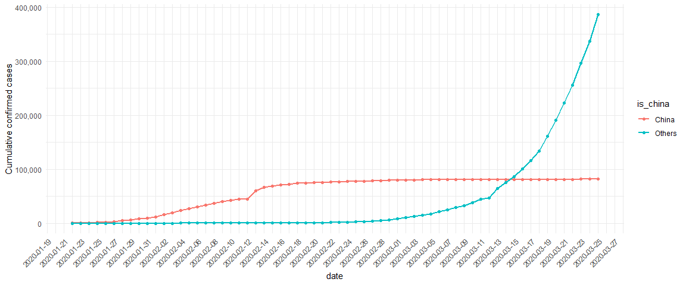


```r
confirmed_cases_china_vs_world %>% 
  filter(type=="death") %>% 
  ggplot(aes(x=date, y=cum_cases)) +
  geom_line(aes(color=is_china), size=1) +
  geom_point(aes(color=is_china))+
  ylab("Cumulative deaths")+
  theme_minimal()+
  scale_y_continuous(labels = comma)+
  scale_x_date(breaks = "2 days")+
  theme(axis.text.x = element_text(angle =45 , hjust = 1))
```

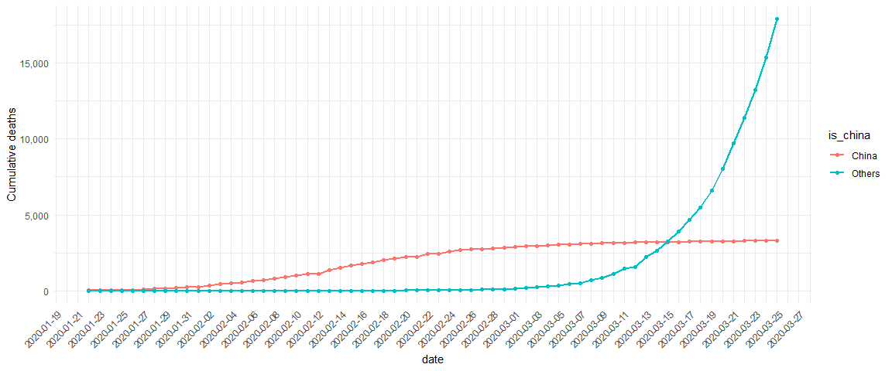


## 4. Let's annotate!
<p>Wow! The two lines have very different shapes. In February, the majority of cases were in China. That changed in March when it really became a global outbreak: around March 14, the total number of cases outside China overtook the cases inside China. This was days after the WHO declared a pandemic.</p>
<p>There were a couple of other landmark events that happened during the outbreak. For example, the huge jump in the China line on February 13, 2020 wasn't just a bad day regarding the outbreak; China changed the way it reported figures on that day (CT scans were accepted as evidence for COVID-19, rather than only lab tests).</p>
<p>By annotating events like this, we can better interpret changes in the plot.</p>


```r
who_events <- tribble(
  ~ date, ~ event,
  "2020-01-30", "Global health\nemergency declared",
  "2020-03-11", "Pandemic\ndeclared",
  "2020-02-13", "China reporting\nchange"
) %>%
  mutate(date = as.Date(date))

# Using who_events, add vertical dashed lines with an xintercept at date
# and text at date, labeled by event, and at 100000 on the y-axis
plt_cum_confirmed_cases_china_vs_world +
  geom_vline(aes(xintercept = date), linetype="dashed", data=who_events) +
  geom_text(aes(x=date, label=event), data=who_events, y=1e5)+
  ggtitle("Confirmed Cases China Vs. Not China along with WHO events")
```

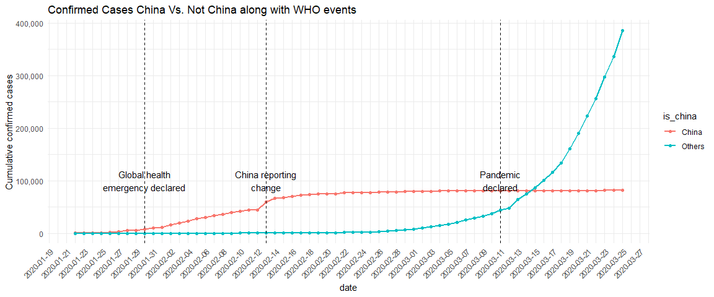


## 5. Adding a trend line to China
<p>When trying to assess how big future problems are going to be, we need a measure of how fast the number of cases is growing. A good starting point is to see if the cases are growing faster or slower than linearly.</p>
<p>There is a clear surge of cases around February 13, 2020, with the reporting change in China. However, a couple of days after, the growth of cases in China slows down. How can we describe COVID-19's growth in China after February 15, 2020?</p>


```r
# Filter for China, from Feb 15
china_after_feb15 <- 
  confirmed_cases_china_vs_world %>%
  filter(type=="confirmed") %>% 
  filter(is_china == "China", date >= "2020-02-15")

# Using china_after_feb15, draw a line plot cum_cases vs. date
# Add a smooth trend line using linear regression, no error bars
china_after_feb15 %>% 
  ggplot(aes(x=date, y=cum_cases, group=1))+
  geom_line() +
  geom_point()+
  geom_smooth(method="lm",se=FALSE) +
  ylab("Cumulative confirmed cases")+
  theme_minimal()+
  scale_y_continuous(labels = comma)+
  scale_x_date(breaks = "2 days")+
  theme(axis.text.x = element_text(angle =45 , hjust = 1))
```

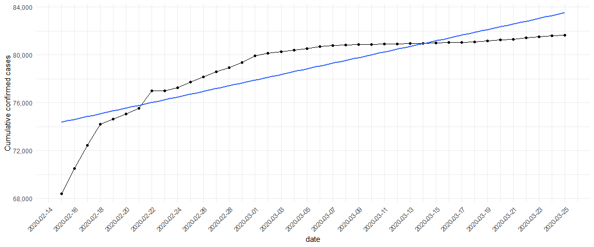

## 6. And the rest of the world?
<p>From the plot above, the growth rate in China is slower than linear. That's great news because it indicates China has at least somewhat contained the virus in late February and early March.</p>
<p>How does the rest of the world compare to linear growth?</p>

```r
not_china <- 
  confirmed_cases_china_vs_world %>% 
  filter(is_china != "China", type=="confirmed")

# Using not_china, draw a line plot cum_cases vs. date
# Add a smooth trend line using linear regression, no error bars
plt_not_china_trend_lin <- 
  ggplot(not_china, aes(x=date, y=cum_cases, group=1)) +
  geom_line() +
  geom_point()+
  geom_smooth(method="lm",se=FALSE) +
  ylab("Cumulative confirmed cases")+
  theme_minimal()

# See the result
plt_not_china_trend_lin +
  scale_y_continuous(labels = comma)+
  scale_x_date(breaks = "2 days")+
  theme(axis.text.x = element_text(angle =45 , hjust = 1))
```

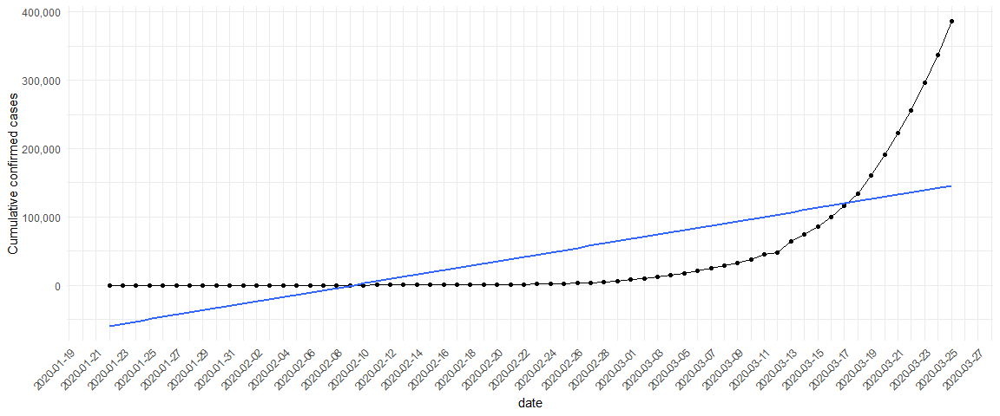

## 7. Adding a logarithmic scale
<p>From the plot above, we can see a straight line does not fit well at all, and the rest of the world is growing much faster than linearly. What if we added a logarithmic scale to the y-axis?</p>


```r
plt_not_china_trend_lin + 
  scale_y_log10()+
  scale_y_continuous(labels = comma)+
  scale_x_date(breaks = "2 days")+
  theme(axis.text.x = element_text(angle =45 , hjust = 1))
```


## 8. Which countries outside of China have been hit hardest?
<p>With the logarithmic scale, we get a much closer fit to the data. From a data science point of view, a good fit is great news. Unfortunately, from a public health point of view, that means that cases of COVID-19 in the rest of the world are growing at an exponential rate, which is terrible news.</p>
<p>Not all countries are being affected by COVID-19 equally, and it would be helpful to know where in the world the problems are greatest. Let's find the countries outside of China with the most confirmed cases in our dataset.</p>


```r
# Group by country, summarize to calculate total cases, find the top 7
top_countries_by_total_cases <- 
    confirmed_cases_worldwide %>%
    group_by(country)%>%
    summarise(total_cases = max(cum_cases))%>%
    arrange(desc(total_cases)) %>%
    head(8)

# See the result
top_countries_by_total_cases %>% 
  arrange(desc(total_cases)) %>% 
  kable("html", align = "llrr",format.args = list(big.mark = ",")) %>%
  kable_styling("striped", "hover")
```

<table class="table table-striped" style="margin-left: auto; margin-right: auto;">
 <thead>
  <tr>
   <th style="text-align:left;"> country </th>
   <th style="text-align:left;"> total_cases </th>
  </tr>
 </thead>
<tbody>
  <tr>
   <td style="text-align:left;"> China </td>
   <td style="text-align:left;"> 81,661 </td>
  </tr>
  <tr>
   <td style="text-align:left;"> Italy </td>
   <td style="text-align:left;"> 74,386 </td>
  </tr>
  <tr>
   <td style="text-align:left;"> US </td>
   <td style="text-align:left;"> 65,778 </td>
  </tr>
  <tr>
   <td style="text-align:left;"> Spain </td>
   <td style="text-align:left;"> 49,515 </td>
  </tr>
  <tr>
   <td style="text-align:left;"> Germany </td>
   <td style="text-align:left;"> 37,323 </td>
  </tr>
  <tr>
   <td style="text-align:left;"> Iran </td>
   <td style="text-align:left;"> 27,017 </td>
  </tr>
  <tr>
   <td style="text-align:left;"> France </td>
   <td style="text-align:left;"> 25,600 </td>
  </tr>
  <tr>
   <td style="text-align:left;"> Switzerland </td>
   <td style="text-align:left;"> 10,897 </td>
  </tr>
</tbody>
</table>

## 9. Plotting hardest hit countries as of Mid-March 2020
<p>Even though the outbreak was first identified in China, there is four of the listed countries (France, Germany, Italy, and Spain) are in Europe and share borders. To get more context, we can plot these countries' confirmed cases over time.</p>
<p>you can do your own analyses with the latest data available <a href="https://github.com/RamiKrispin/coronavirus">here</a>. </p>


```r
# Run this to get the data for the top 7 countries
confirmed_cases_top7_outside_china <-
  confirmed_cases_worldwide %>% 
  filter(country %in% top_countries_by_total_cases$country & country != "China" &
           type=="confirmed")

# Using confirmed_cases_top7_outside_china, draw a line plot of
# cum_cases vs. date, grouped and colored by country
confirmed_cases_top7_outside_china %>%
  ggplot(aes(x=date, y=cum_cases))+
  geom_line(aes(color=country, group=country), size=1)+
  geom_point(aes(color=country))+
  ylab("Cumulative confirmed cases")+
  scale_y_continuous(labels = comma)+
  scale_x_date(breaks = "2 days")+
  theme_minimal()+
  theme(axis.text.x = element_text(angle =45 , hjust = 1))+
  ggtitle("Top 7 Countries outside china confirmed cases")
```

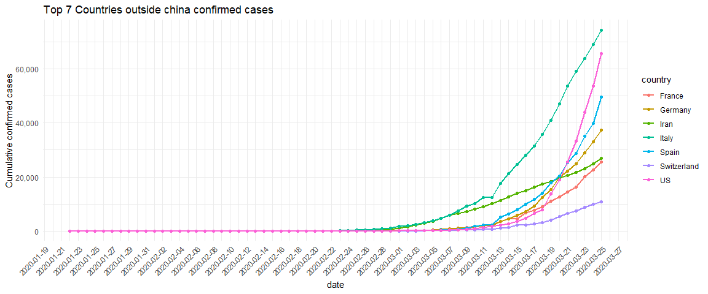

## 10. Egypt Analysis


```r
confirmed_cases_worldwide %>% 
  filter(type=="confirmed" & country =="Egypt") %>% 
  group_by(date, type) %>% 
  summarise(cum_cases = sum(cum_cases)) %>% 
  ggplot(aes(x=date, y=cum_cases))+
  geom_line(size=1, color="blue") +
  geom_point(color="blue")+
  ylab("Cumulative confirmed cases")+
  ggtitle("Confirmed cases trend in Egypt")+
  theme_minimal()+
  scale_y_continuous(labels = comma)+
  scale_x_date(breaks = "2 days")+
  theme(axis.text.x = element_text(angle =45 , hjust = 1))
```

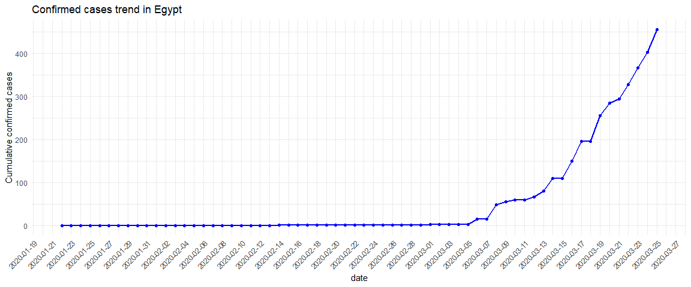


<p>Breaking point in Egypt started at 8th of March approximately</p>


```r
confirmed_cases_worldwide %>% 
  filter(type=="death", country == "Egypt") %>% 
  group_by(date, type) %>% 
  summarise(cum_cases = sum(cum_cases)) %>% 
  ggplot(aes(x=date, y=cum_cases))+
  geom_line(size=1) +
  geom_point()+
  ylab("Cumulative confirmed deaths")+
  ggtitle("Confirmed deaths trend in Egypt")+
  theme_minimal()+
  scale_y_continuous(labels = comma)+
  scale_x_date(breaks = "2 days")+
  theme(axis.text.x = element_text(angle =45 , hjust = 1))
```

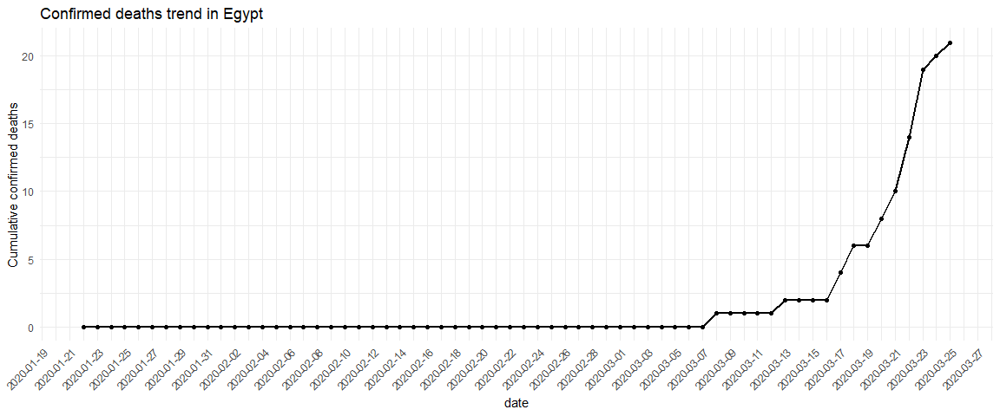


## Egypt trend with WHO Events

```r
base_plt <- 
  confirmed_cases_worldwide %>% 
  filter(type=="confirmed", country=="Egypt") %>% 
  ggplot(aes(x=date, y=cum_cases)) +
  geom_line(size=1, color="red") +
  geom_point(color="red")+
  ylab("Cumulative confirmed cases In Egypt")+
  theme_minimal()+
  scale_y_continuous(labels = comma)+
  scale_x_date(breaks = "2 days")+
  theme(axis.text.x = element_text(angle =45 , hjust = 1))

base_plt +
  geom_vline(aes(xintercept = date), linetype="dashed", data=who_events) +
  geom_text(aes(x=date, label=event), data=who_events, y=250)+
  ggtitle("Confirmed Cases In Egypt along with WHO events")
```

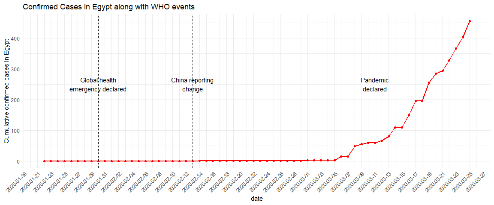


*Egypt numbers in tabular format*


```r
confirmed_cases_worldwide %>% 
  arrange(date) %>% 
  group_by(country, date, type) %>% 
  summarise(
    cum_cases = max(cum_cases)
  ) %>% 
  filter(country == "Egypt") %>% 
  ungroup() %>% 
  spread(type, cum_cases) %>% 
  kable("html", align = "llrr",format.args = list(big.mark = ",")) %>%
  kable_styling("striped", "hover") %>% 
  scroll_box(height = "256px", width = "100%")
```

<div style="border: 1px solid #ddd; padding: 0px; overflow-y: scroll; height:256px; overflow-x: scroll; width:100%; "><table class="table table-striped" style="margin-left: auto; margin-right: auto;">
 <thead>
  <tr>
   <th style="text-align:left;position: sticky; top:0; background-color: #FFFFFF;"> country </th>
   <th style="text-align:left;position: sticky; top:0; background-color: #FFFFFF;"> date </th>
   <th style="text-align:right;position: sticky; top:0; background-color: #FFFFFF;"> confirmed </th>
   <th style="text-align:right;position: sticky; top:0; background-color: #FFFFFF;"> death </th>
  </tr>
 </thead>
<tbody>
  <tr>
   <td style="text-align:left;"> Egypt </td>
   <td style="text-align:left;"> 2020-01-22 </td>
   <td style="text-align:right;"> 0 </td>
   <td style="text-align:right;"> 0 </td>
  </tr>
  <tr>
   <td style="text-align:left;"> Egypt </td>
   <td style="text-align:left;"> 2020-01-23 </td>
   <td style="text-align:right;"> 0 </td>
   <td style="text-align:right;"> 0 </td>
  </tr>
  <tr>
   <td style="text-align:left;"> Egypt </td>
   <td style="text-align:left;"> 2020-01-24 </td>
   <td style="text-align:right;"> 0 </td>
   <td style="text-align:right;"> 0 </td>
  </tr>
  <tr>
   <td style="text-align:left;"> Egypt </td>
   <td style="text-align:left;"> 2020-01-25 </td>
   <td style="text-align:right;"> 0 </td>
   <td style="text-align:right;"> 0 </td>
  </tr>
  <tr>
   <td style="text-align:left;"> Egypt </td>
   <td style="text-align:left;"> 2020-01-26 </td>
   <td style="text-align:right;"> 0 </td>
   <td style="text-align:right;"> 0 </td>
  </tr>
  <tr>
   <td style="text-align:left;"> Egypt </td>
   <td style="text-align:left;"> 2020-01-27 </td>
   <td style="text-align:right;"> 0 </td>
   <td style="text-align:right;"> 0 </td>
  </tr>
  <tr>
   <td style="text-align:left;"> Egypt </td>
   <td style="text-align:left;"> 2020-01-28 </td>
   <td style="text-align:right;"> 0 </td>
   <td style="text-align:right;"> 0 </td>
  </tr>
  <tr>
   <td style="text-align:left;"> Egypt </td>
   <td style="text-align:left;"> 2020-01-29 </td>
   <td style="text-align:right;"> 0 </td>
   <td style="text-align:right;"> 0 </td>
  </tr>
  <tr>
   <td style="text-align:left;"> Egypt </td>
   <td style="text-align:left;"> 2020-01-30 </td>
   <td style="text-align:right;"> 0 </td>
   <td style="text-align:right;"> 0 </td>
  </tr>
  <tr>
   <td style="text-align:left;"> Egypt </td>
   <td style="text-align:left;"> 2020-01-31 </td>
   <td style="text-align:right;"> 0 </td>
   <td style="text-align:right;"> 0 </td>
  </tr>
  <tr>
   <td style="text-align:left;"> Egypt </td>
   <td style="text-align:left;"> 2020-02-01 </td>
   <td style="text-align:right;"> 0 </td>
   <td style="text-align:right;"> 0 </td>
  </tr>
  <tr>
   <td style="text-align:left;"> Egypt </td>
   <td style="text-align:left;"> 2020-02-02 </td>
   <td style="text-align:right;"> 0 </td>
   <td style="text-align:right;"> 0 </td>
  </tr>
  <tr>
   <td style="text-align:left;"> Egypt </td>
   <td style="text-align:left;"> 2020-02-03 </td>
   <td style="text-align:right;"> 0 </td>
   <td style="text-align:right;"> 0 </td>
  </tr>
  <tr>
   <td style="text-align:left;"> Egypt </td>
   <td style="text-align:left;"> 2020-02-04 </td>
   <td style="text-align:right;"> 0 </td>
   <td style="text-align:right;"> 0 </td>
  </tr>
  <tr>
   <td style="text-align:left;"> Egypt </td>
   <td style="text-align:left;"> 2020-02-05 </td>
   <td style="text-align:right;"> 0 </td>
   <td style="text-align:right;"> 0 </td>
  </tr>
  <tr>
   <td style="text-align:left;"> Egypt </td>
   <td style="text-align:left;"> 2020-02-06 </td>
   <td style="text-align:right;"> 0 </td>
   <td style="text-align:right;"> 0 </td>
  </tr>
  <tr>
   <td style="text-align:left;"> Egypt </td>
   <td style="text-align:left;"> 2020-02-07 </td>
   <td style="text-align:right;"> 0 </td>
   <td style="text-align:right;"> 0 </td>
  </tr>
  <tr>
   <td style="text-align:left;"> Egypt </td>
   <td style="text-align:left;"> 2020-02-08 </td>
   <td style="text-align:right;"> 0 </td>
   <td style="text-align:right;"> 0 </td>
  </tr>
  <tr>
   <td style="text-align:left;"> Egypt </td>
   <td style="text-align:left;"> 2020-02-09 </td>
   <td style="text-align:right;"> 0 </td>
   <td style="text-align:right;"> 0 </td>
  </tr>
  <tr>
   <td style="text-align:left;"> Egypt </td>
   <td style="text-align:left;"> 2020-02-10 </td>
   <td style="text-align:right;"> 0 </td>
   <td style="text-align:right;"> 0 </td>
  </tr>
  <tr>
   <td style="text-align:left;"> Egypt </td>
   <td style="text-align:left;"> 2020-02-11 </td>
   <td style="text-align:right;"> 0 </td>
   <td style="text-align:right;"> 0 </td>
  </tr>
  <tr>
   <td style="text-align:left;"> Egypt </td>
   <td style="text-align:left;"> 2020-02-12 </td>
   <td style="text-align:right;"> 0 </td>
   <td style="text-align:right;"> 0 </td>
  </tr>
  <tr>
   <td style="text-align:left;"> Egypt </td>
   <td style="text-align:left;"> 2020-02-13 </td>
   <td style="text-align:right;"> 0 </td>
   <td style="text-align:right;"> 0 </td>
  </tr>
  <tr>
   <td style="text-align:left;"> Egypt </td>
   <td style="text-align:left;"> 2020-02-14 </td>
   <td style="text-align:right;"> 1 </td>
   <td style="text-align:right;"> 0 </td>
  </tr>
  <tr>
   <td style="text-align:left;"> Egypt </td>
   <td style="text-align:left;"> 2020-02-15 </td>
   <td style="text-align:right;"> 1 </td>
   <td style="text-align:right;"> 0 </td>
  </tr>
  <tr>
   <td style="text-align:left;"> Egypt </td>
   <td style="text-align:left;"> 2020-02-16 </td>
   <td style="text-align:right;"> 1 </td>
   <td style="text-align:right;"> 0 </td>
  </tr>
  <tr>
   <td style="text-align:left;"> Egypt </td>
   <td style="text-align:left;"> 2020-02-17 </td>
   <td style="text-align:right;"> 1 </td>
   <td style="text-align:right;"> 0 </td>
  </tr>
  <tr>
   <td style="text-align:left;"> Egypt </td>
   <td style="text-align:left;"> 2020-02-18 </td>
   <td style="text-align:right;"> 1 </td>
   <td style="text-align:right;"> 0 </td>
  </tr>
  <tr>
   <td style="text-align:left;"> Egypt </td>
   <td style="text-align:left;"> 2020-02-19 </td>
   <td style="text-align:right;"> 1 </td>
   <td style="text-align:right;"> 0 </td>
  </tr>
  <tr>
   <td style="text-align:left;"> Egypt </td>
   <td style="text-align:left;"> 2020-02-20 </td>
   <td style="text-align:right;"> 1 </td>
   <td style="text-align:right;"> 0 </td>
  </tr>
  <tr>
   <td style="text-align:left;"> Egypt </td>
   <td style="text-align:left;"> 2020-02-21 </td>
   <td style="text-align:right;"> 1 </td>
   <td style="text-align:right;"> 0 </td>
  </tr>
  <tr>
   <td style="text-align:left;"> Egypt </td>
   <td style="text-align:left;"> 2020-02-22 </td>
   <td style="text-align:right;"> 1 </td>
   <td style="text-align:right;"> 0 </td>
  </tr>
  <tr>
   <td style="text-align:left;"> Egypt </td>
   <td style="text-align:left;"> 2020-02-23 </td>
   <td style="text-align:right;"> 1 </td>
   <td style="text-align:right;"> 0 </td>
  </tr>
  <tr>
   <td style="text-align:left;"> Egypt </td>
   <td style="text-align:left;"> 2020-02-24 </td>
   <td style="text-align:right;"> 1 </td>
   <td style="text-align:right;"> 0 </td>
  </tr>
  <tr>
   <td style="text-align:left;"> Egypt </td>
   <td style="text-align:left;"> 2020-02-25 </td>
   <td style="text-align:right;"> 1 </td>
   <td style="text-align:right;"> 0 </td>
  </tr>
  <tr>
   <td style="text-align:left;"> Egypt </td>
   <td style="text-align:left;"> 2020-02-26 </td>
   <td style="text-align:right;"> 1 </td>
   <td style="text-align:right;"> 0 </td>
  </tr>
  <tr>
   <td style="text-align:left;"> Egypt </td>
   <td style="text-align:left;"> 2020-02-27 </td>
   <td style="text-align:right;"> 1 </td>
   <td style="text-align:right;"> 0 </td>
  </tr>
  <tr>
   <td style="text-align:left;"> Egypt </td>
   <td style="text-align:left;"> 2020-02-28 </td>
   <td style="text-align:right;"> 1 </td>
   <td style="text-align:right;"> 0 </td>
  </tr>
  <tr>
   <td style="text-align:left;"> Egypt </td>
   <td style="text-align:left;"> 2020-02-29 </td>
   <td style="text-align:right;"> 1 </td>
   <td style="text-align:right;"> 0 </td>
  </tr>
  <tr>
   <td style="text-align:left;"> Egypt </td>
   <td style="text-align:left;"> 2020-03-01 </td>
   <td style="text-align:right;"> 2 </td>
   <td style="text-align:right;"> 0 </td>
  </tr>
  <tr>
   <td style="text-align:left;"> Egypt </td>
   <td style="text-align:left;"> 2020-03-02 </td>
   <td style="text-align:right;"> 2 </td>
   <td style="text-align:right;"> 0 </td>
  </tr>
  <tr>
   <td style="text-align:left;"> Egypt </td>
   <td style="text-align:left;"> 2020-03-03 </td>
   <td style="text-align:right;"> 2 </td>
   <td style="text-align:right;"> 0 </td>
  </tr>
  <tr>
   <td style="text-align:left;"> Egypt </td>
   <td style="text-align:left;"> 2020-03-04 </td>
   <td style="text-align:right;"> 2 </td>
   <td style="text-align:right;"> 0 </td>
  </tr>
  <tr>
   <td style="text-align:left;"> Egypt </td>
   <td style="text-align:left;"> 2020-03-05 </td>
   <td style="text-align:right;"> 3 </td>
   <td style="text-align:right;"> 0 </td>
  </tr>
  <tr>
   <td style="text-align:left;"> Egypt </td>
   <td style="text-align:left;"> 2020-03-06 </td>
   <td style="text-align:right;"> 15 </td>
   <td style="text-align:right;"> 0 </td>
  </tr>
  <tr>
   <td style="text-align:left;"> Egypt </td>
   <td style="text-align:left;"> 2020-03-07 </td>
   <td style="text-align:right;"> 15 </td>
   <td style="text-align:right;"> 0 </td>
  </tr>
  <tr>
   <td style="text-align:left;"> Egypt </td>
   <td style="text-align:left;"> 2020-03-08 </td>
   <td style="text-align:right;"> 49 </td>
   <td style="text-align:right;"> 1 </td>
  </tr>
  <tr>
   <td style="text-align:left;"> Egypt </td>
   <td style="text-align:left;"> 2020-03-09 </td>
   <td style="text-align:right;"> 55 </td>
   <td style="text-align:right;"> 1 </td>
  </tr>
  <tr>
   <td style="text-align:left;"> Egypt </td>
   <td style="text-align:left;"> 2020-03-10 </td>
   <td style="text-align:right;"> 59 </td>
   <td style="text-align:right;"> 1 </td>
  </tr>
  <tr>
   <td style="text-align:left;"> Egypt </td>
   <td style="text-align:left;"> 2020-03-11 </td>
   <td style="text-align:right;"> 60 </td>
   <td style="text-align:right;"> 1 </td>
  </tr>
  <tr>
   <td style="text-align:left;"> Egypt </td>
   <td style="text-align:left;"> 2020-03-12 </td>
   <td style="text-align:right;"> 67 </td>
   <td style="text-align:right;"> 1 </td>
  </tr>
  <tr>
   <td style="text-align:left;"> Egypt </td>
   <td style="text-align:left;"> 2020-03-13 </td>
   <td style="text-align:right;"> 80 </td>
   <td style="text-align:right;"> 2 </td>
  </tr>
  <tr>
   <td style="text-align:left;"> Egypt </td>
   <td style="text-align:left;"> 2020-03-14 </td>
   <td style="text-align:right;"> 109 </td>
   <td style="text-align:right;"> 2 </td>
  </tr>
  <tr>
   <td style="text-align:left;"> Egypt </td>
   <td style="text-align:left;"> 2020-03-15 </td>
   <td style="text-align:right;"> 110 </td>
   <td style="text-align:right;"> 2 </td>
  </tr>
  <tr>
   <td style="text-align:left;"> Egypt </td>
   <td style="text-align:left;"> 2020-03-16 </td>
   <td style="text-align:right;"> 150 </td>
   <td style="text-align:right;"> 2 </td>
  </tr>
  <tr>
   <td style="text-align:left;"> Egypt </td>
   <td style="text-align:left;"> 2020-03-17 </td>
   <td style="text-align:right;"> 196 </td>
   <td style="text-align:right;"> 4 </td>
  </tr>
  <tr>
   <td style="text-align:left;"> Egypt </td>
   <td style="text-align:left;"> 2020-03-18 </td>
   <td style="text-align:right;"> 196 </td>
   <td style="text-align:right;"> 6 </td>
  </tr>
  <tr>
   <td style="text-align:left;"> Egypt </td>
   <td style="text-align:left;"> 2020-03-19 </td>
   <td style="text-align:right;"> 256 </td>
   <td style="text-align:right;"> 6 </td>
  </tr>
  <tr>
   <td style="text-align:left;"> Egypt </td>
   <td style="text-align:left;"> 2020-03-20 </td>
   <td style="text-align:right;"> 285 </td>
   <td style="text-align:right;"> 8 </td>
  </tr>
  <tr>
   <td style="text-align:left;"> Egypt </td>
   <td style="text-align:left;"> 2020-03-21 </td>
   <td style="text-align:right;"> 294 </td>
   <td style="text-align:right;"> 10 </td>
  </tr>
  <tr>
   <td style="text-align:left;"> Egypt </td>
   <td style="text-align:left;"> 2020-03-22 </td>
   <td style="text-align:right;"> 327 </td>
   <td style="text-align:right;"> 14 </td>
  </tr>
  <tr>
   <td style="text-align:left;"> Egypt </td>
   <td style="text-align:left;"> 2020-03-23 </td>
   <td style="text-align:right;"> 366 </td>
   <td style="text-align:right;"> 19 </td>
  </tr>
  <tr>
   <td style="text-align:left;"> Egypt </td>
   <td style="text-align:left;"> 2020-03-24 </td>
   <td style="text-align:right;"> 402 </td>
   <td style="text-align:right;"> 20 </td>
  </tr>
  <tr>
   <td style="text-align:left;"> Egypt </td>
   <td style="text-align:left;"> 2020-03-25 </td>
   <td style="text-align:right;"> 456 </td>
   <td style="text-align:right;"> 21 </td>
  </tr>
</tbody>
</table></div>

*Along with Events from WHO there are decisions taken by Egyption Governate that should be highlighted also*

## Egypt trend with Governmental Decisions


```r
egypt_events <- tribble(
  ~ date, ~ event,
  "2020-03-14", "Suspend \nfor Schools \nand Universities",
  "2020-03-21", "Close all\n mosques and churches",
  "2020-03-25", "Curfew from 7 PM\nand stop \ngovernmanetal \nservices"
) %>%
  mutate(date = as.Date(date))
```


```r
base_plt <- 
  confirmed_cases_worldwide %>% 
  filter(type=="confirmed", country=="Egypt") %>% 
  ggplot(aes(x=date, y=cum_cases)) +
  geom_line(size=1, color="red") +
  geom_point(color="red")+
  ylab("Cumulative confirmed cases In Egypt")+
  theme_minimal()+
  scale_y_continuous(labels = comma)+
  scale_x_date(breaks = "2 days")+
  theme(axis.text.x = element_text(angle = 45 , hjust = 1))

base_plt +
  geom_vline(aes(xintercept = date), linetype="dashed", data=egypt_events) +
  geom_text(aes(x=date, label=event), data=egypt_events, y=c(250,300,400))+
  ggtitle("Confirmed Cases In Egypt along with WHO events")
```

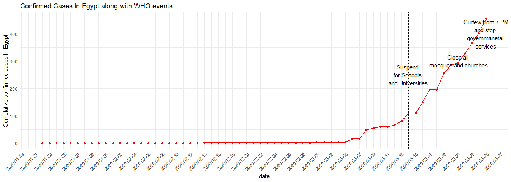


